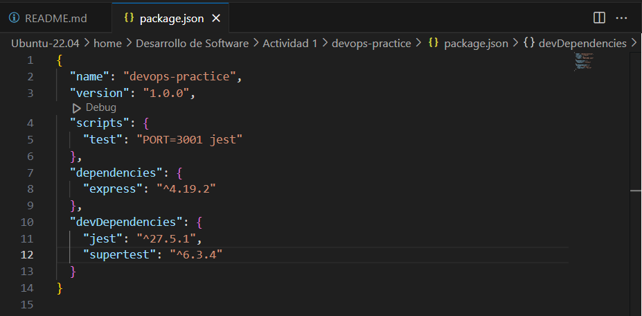
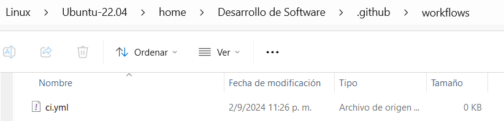
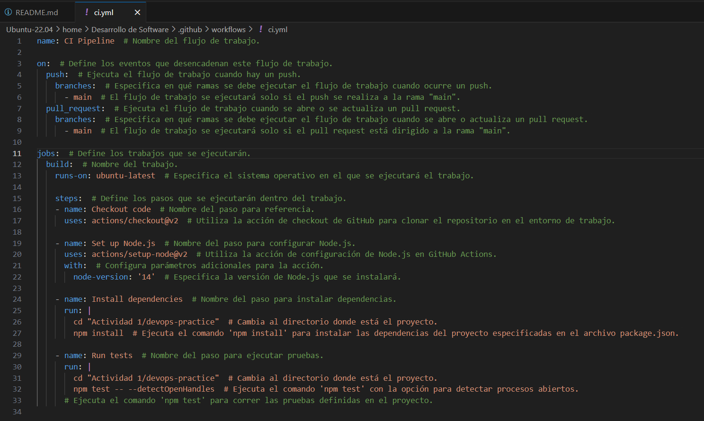
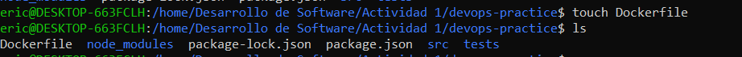
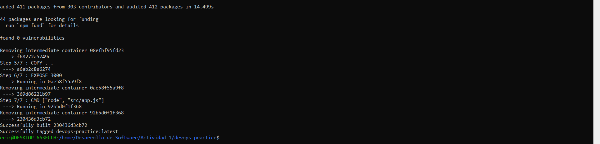

## 1. Preguntas de reflexión:
**• Pregunta 1:** ¿Por qué surgió la necesidad de DevOps en el desarrollo de software?
> La necesidad des DevOps surge a partir de la problemática que se genera entre los equipos de desarrollo y operaciones, los cuales se ven afectados debido a que el software estaba en constante evolución y esto mismo ocasionaba que, mientras el equipo de desarrollo deseaba agregar más funcionalidades, el equipo de operaciones quería priorizar la estabilidad, lo cual generaba retrasos y errores.

**• Pregunta 2:** Explica cómo la falta de comunicación y coordinación entre los equipos de desarrollo y operaciones en el pasado ha llevado a la creación de DevOps.
> Anteriormente, los equipos de desarrollo y operaciones estaban en silos separados. Estos silos generaban que la falta de comunicación afectara mucho la integración del código desarrollado, ya que ambos equipos tenían objetivos separados. De esta forma, nació la necesidad de crear DevOps como un enfoque que busca romper estos silos, alineando las metas que se tienen al momento de desarrollar software.

**• Pregunta 3:** Describe cómo el principio de mejora continua afecta tanto a los aspectos técnicos como culturales de una organización.
> El mejorar continuamente es un principio de DevOps que ayuda a mejorar la eficiencia y calidad del software desarrollado al automatizar los flujos de trabajo. Esto impacta en la parte cultural respecto a cómo se trabaja, promoviendo una forma colaborativa que impulsa el aprendizaje y la responsabilidad, ayudando a eliminar los silos existentes.

**• Pregunta 4:** ¿Qué significa que DevOps no se trata solo de herramientas, individuos o procesos?
> Significa que DevOps va mucho más allá, estableciéndose como un cambio cultural que elimina las dificultades generadas por los silos al implementar la colaboración entre los equipos de desarrollo y operaciones, alineando sus metas para que ambos trabajen de forma más eficiente y mejoren la calidad al desarrollar software.

**• Pregunta 5:** Según el texto, ¿cómo contribuyen los equipos autónomos y multifuncionales a una implementación exitosa de DevOps?
> Estos equipos son fundamentales para la implementación de DevOps, ya que permiten eficiencia al momento de tomar decisiones. Debido a que estos equipos tienen habilidades desde la codificación y pruebas hasta la implementación del software, pueden supervisarlo hasta el día en que se entregue, eliminando así los cuellos de botella provocados por la forma jerárquica y tradicional de trabajar.

## 2. Aplicar los conceptos de DevOps en un entorno práctico, configurando un pipeline básico de CI/CD para un proyecto de software y experimentando con la automatización de procesos en un entorno local utilizando Docker

**1. Configuración del entorno**
1. Inicializa el proyecto de Node.js:
 ~~~
mkdir devops-practice  # Crea un nuevo directorio llamado "devops-practice"
cd devops-practice     # Cambia el directorio actual a "devops-practice"
npm init -y            # Inicializo un nuevo proyecto de Node.js predeterminado y genera un archivo `package.json`
 ~~~
 
 
> Como podemos observar, los comandos se ejecutaron de forma correcta, creando el proyecto con las configuraciones predeterminadas.
2. Instalar las dependencias necesarias:
~~~
 npm install express jest supertest  # Instala las dependencias de Express y Jest en el proyecto.
~~~

> El comando instalo las dependencias de Express y Jest, las cuales consisten en :

>Express: Es un marco de aplicación web minimalista para Node.js. Se utiliza para crear y manejar servidores web, gestionar rutas, manejar solicitudes y respuestas HTTP, y desarrollar aplicaciones web y APIs de manera eficiente y estructurada.

>Jest: Es un framework de pruebas en JavaScript desarrollado por Facebook. Se utiliza para escribir, ejecutar y gestionar pruebas de unidad, pruebas de integración y pruebas de extremo a extremo para asegurar que el código funcione correctamente. Jest es conocido por su facilidad de uso, su configuración mínima y sus capacidades avanzadas, como la generación de informes de cobertura de código y la ejecución de pruebas en paralelo.

3. Crea la estructura del proyecto:
~~~
mkdir src tests                # Crea dos nuevos directorios: "src" para el código fuente y "tests" para las pruebas
touch src/app.js tests/app.test.js  # Crea archivos vacíos "app.js" en el directorio "src" y "app.test.js" en el directorio "tests"
~~~

> Los comandos crearon nuevos directorios tanto para el codigo fuente como para las pruebas.
4. Implementa la API REST en src/app.js:
~~~
const express = require('express');  // Importa el módulo Express
const app = express();  // Crea una instancia de la aplicación Express

app.get('/', (req, res) => {  // Define una ruta GET en la raíz
  res.send('Hello, World!');  // Envía una respuesta de texto 'Hello, World!' al cliente
});

const port = process.env.PORT || 3000;  // Define el puerto en el que la aplicación escuchará

const server = app.listen(port, () => {  // Hace que la aplicación escuche en el puerto definido y guarda la referencia al servidor
  console.log(`Server running on port ${port}`);  // Imprime en la consola un mensaje indicando
});

// Exporta la aplicación y el servidor para que puedan ser utilizados en otros módulos, como en pruebas
module.exports = { app, server };
~~~

> Una API REST permite la creación de servicios web que son fáciles de entender, escalar y mantener

5. Escribe un test básico en tests/app.test.js:
~~~
const request = require('supertest');
const { app, server } = require('../src/app');  // Importa tanto la aplicación como el servidor

afterAll((done) => {
  server.close(done);  // Cierra el servidor al finalizar las pruebas
});

test('should return Hello, World!', async () => {
  const res = await request(app).get('/');  // Utiliza `app` para realizar solicitudes en las pruebas
  expect(res.statusCode).toEqual(200);  // Verifica que el código de estado de la respuesta sea 200 (OK)
  expect(res.text).toBe('Hello, World!');  // Verifica que el texto de la respuesta sea 'Hello, World!'
});
~~~

>Este bloque de código es un test que verifica si la aplicación Express devuelve correctamente la cadena "Hello, World!" cuando se hace una solicitud GET a la ruta raíz /. La prueba utiliza supertest para simular solicitudes HTTP y Jest (implícitamente a través de describe e it) para realizar las afirmaciones sobre el comportamiento de la aplicación.
6. Configura el script de test en package.json:

>package.json - Descripción de Campos

>- **name:** El nombre del proyecto.
>- **version:** La versión actual del proyecto.
>- **scripts:** Comandos personalizados que se pueden ejecutar con npm.
>- **dependencies:** Paquetes necesarios para ejecutar la aplicación.
>- **devDependencies:** Paquetes necesarios solo para el desarrollo y pruebas.

**2. Pipeline CI/CD**

**Parte 1:** Configura integración continua (CI) con GitHub Actions
 - Crea un archivo de configuración para GitHub Actions:
 1. Crea la estructura para GitHub Actions:
~~~
mkdir -p .github/workflows  # Crea el directorio .github/workflows, junto con sus directorios padres si no existen
touch .github/workflows/ci.yml  # Crea un archivo vacío llamado ci.yml dentro del directorio .github/workflows
~~~

> Se creó correctamente el directorio .github/workflows y el archivo ci.yml

2. Define el flujo de trabajo en .github/workflows/ci.yml:
~~~
name: CI Pipeline  # Nombre del flujo de trabajo.

on:  # Define los eventos que desencadenan este flujo de trabajo.
  push:  # Ejecuta el flujo de trabajo cuando hay un push.
    branches:  # Especifica en qué ramas se debe ejecutar el flujo de trabajo cuando ocurre un push.
      - main  # El flujo de trabajo se ejecutará solo si el push se realiza a la rama "main".
  pull_request:  # Ejecuta el flujo de trabajo cuando se abre o se actualiza un pull request.
    branches:  # Especifica en qué ramas se debe ejecutar el flujo de trabajo cuando se abre o actualiza un pull request.
      - main  # El flujo de trabajo se ejecutará solo si el pull request está dirigido a la rama "main".

jobs:  # Define los trabajos que se ejecutarán.
  build:  # Nombre del trabajo.
    runs-on: ubuntu-latest  # Especifica el sistema operativo en el que se ejecutará el trabajo.

    steps:  # Define los pasos que se ejecutarán dentro del trabajo.
    - name: Checkout code  # Nombre del paso para referencia.
      uses: actions/checkout@v2  # Utiliza la acción de checkout de GitHub para clonar el repositorio en el entorno de trabajo.

    - name: Set up Node.js  # Nombre del paso para configurar Node.js.
      uses: actions/setup-node@v2  # Utiliza la acción de configuración de Node.js en GitHub Actions.
      with:  # Configura parámetros adicionales para la acción.
        node-version: '14'  # Especifica la versión de Node.js que se instalará.

    - name: Install dependencies  # Nombre del paso para instalar dependencias.
      run: |
        cd "Actividad 1/devops-practice"  # Cambia al directorio donde está el proyecto.
        npm install  
      # Ejecuta el comando 'npm install' para instalar las dependencias del proyecto especificadas en el archivo package.json.

    - name: Run tests  # Nombre del paso para ejecutar pruebas.
      run: |
        cd "Actividad 1/devops-practice"  # Cambia al directorio donde está el proyecto.
        npm test  
      # Ejecuta el comando 'npm test' para correr las pruebas definidas en el proyecto.
~~~

3. Sube el código a GitHub:
 - Crea un nuevo repositorio en GitHub y empuja tu código:
~~~
git init  # Inicializa un nuevo repositorio Git
echo "node_modules/" >> .gitignore  # Ignorar dependencias de Node.js
git add .  # Añade todos los archivos al área de preparación
git commit -m "Initial commit"  # Crea un commit con un mensaje
git branch -M main  # Renombra la rama actual a 'main'
git remote add origin <your-repo-url>  # Añade un repositorio remoto llamado 'origin'
git push -u origin main  # Sube los cambios a la rama 'main' del repositorio remoto
~~~

>El proyecto se ha subido correctamente al repositorio en GitHub. Las pruebas automatizadas en GitHub Actions se ejecutaron con éxito, validando la correcta implementación y funcionamiento del código. Esto asegura la calidad y estabilidad del proyecto a medida que se continúa con su desarrollo.

**Parte 2:** Configura entrega continua (CD) con Docker
 - Crea un archivo Docker para contenerizar la aplicación:
 1. Crea un archivo Dockerfile:

~~~
 # Usa la imagen oficial de Node.js
 FROM node:14
 # Establece el directorio de trabajo en el contenedor
 WORKDIR /app
 # Copia los archivos package.json y package-lock.json
 COPY package*.json ./
 # Instala las dependencias
 RUN npm install
 # Copia el resto de los archivos de la aplicación
 COPY . .
 # Expone el puerto en el que la aplicación correrá
 EXPOSE 3000
 # Comando para iniciar la aplicación
 CMD ["node", "src/app.js"]
~~~

> Se configuró el archivo Dockerfile.

2. Construye la imagen de Docker: 
~~~
docker build -t devops-practice .  # Construye una imagen Docker a partir del Dockerfile en el directorio actual, etiquetándola como devops-practice
~~~

> Se construyó con éxito la imagen Docker llamada `devops-practice`.

 3. Corre el contenedor localmente:
 ~~~
 docker run -p 3000:3000 devops-practice  # Ejecuta un contenedor basado en la imagen 'devops-practice' y mapea el puerto 3000 del contenedor al puerto 3000 de la máquina local
 ~~~

 - Automatiza el despliegue con GitHub Actions:
 1. Actualiza el archivo .github/workflows/ci.yml para construir y desplegar la imagen de Docker:
 ~~~
name: CI/CD Pipeline  # Nombre del flujo de trabajo.

on:  # Define los eventos que desencadenan este flujo de trabajo.
  push:  # Ejecuta el flujo de trabajo cuando hay un push.
    branches:  # Especifica en qué ramas se debe ejecutar el flujo de trabajo cuando ocurre un push.
      - main  # El flujo de trabajo se ejecutará solo si el push se realiza a la rama "main".
  pull_request:  # Ejecuta el flujo de trabajo cuando se abre o se actualiza un pull request.
    branches:  # Especifica en qué ramas se debe ejecutar el flujo de trabajo cuando se abre o actualiza un pull request.
      - main  # El flujo de trabajo se ejecutará solo si el pull request está dirigido a la rama "main".

jobs:  # Define los trabajos que se ejecutarán.
  build:  # Nombre del trabajo.
    runs-on: ubuntu-latest  # Especifica el sistema operativo en el que se ejecutará el trabajo.

    steps:  # Define los pasos que se ejecutarán dentro del trabajo.
    - name: Checkout code  # Nombre del paso para clonar el código.
      uses: actions/checkout@v2  # Utiliza la acción de checkout de GitHub para clonar el repositorio en el entorno de trabajo.

    - name: Set up Node.js  # Nombre del paso para configurar Node.js.
      uses: actions/setup-node@v2  # Utiliza la acción de configuración de Node.js en GitHub Actions.
      with:  # Configura parámetros adicionales para la acción.
        node-version: '14'  # Especifica la versión de Node.js que se instalará.

    - name: Install dependencies  # Nombre del paso para instalar dependencias.
      run: |
        cd "Actividad 1/devops-practice"  # Cambia al directorio donde está el proyecto.
        npm install  # Ejecuta el comando 'npm install' para instalar las dependencias del proyecto especificadas en el archivo package.json.

    - name: Run tests  # Nombre del paso para ejecutar pruebas.
      run: |
        cd "Actividad 1/devops-practice"  # Cambia al directorio donde está el proyecto.
        npm test  # Ejecuta el comando 'npm test' para correr las pruebas definidas en el proyecto.

    - name: Build Docker image  # Nombre del paso para construir la imagen Docker.
      run: |
        cd "Actividad 1/devops-practice"  # Cambia al directorio donde está el Dockerfile.
        docker build -t devops-practice .  # Construye la imagen Docker con la etiqueta 'devops-practice'.

    - name: Run Docker container  # Nombre del paso para ejecutar el contenedor Docker.
      run: |
        cd "Actividad 1/devops-practice"  # Cambia al directorio donde está la imagen Docker.
        docker run -d -p 3000:3000 devops-practice  # Ejecuta el contenedor Docker en segundo plano con el puerto 3000 expuesto.
 ~~~

~~~
name: Build Docker image  # Construye la imagen Docker.
      run: docker build -t devops-practice .  # Construye la imagen Docker usando el Dockerfile, etiquetándola como 'devops-practice'.
name: Run Docker container  # Ejecuta un contenedor Docker basado en la imagen recién construida.
      run: docker run -d -p 3000:3000 devops-practice  # Ejecuta el contenedor en segundo plano y mapea el puerto 3000.
~~~
2. Verifica que la aplicación se despliegue correctamente localmente usando Docker:
 - Abre un navegador web y accede a http://localhost:3000 para verificar que la aplicación esté
funcionando.

**3. Automatización**
 - Automatiza la configuración y gestión del entorno local usando Docker Compose:
 1. Crea un archivo docker-compose.yml:
 
 
 ~~~
 version: '3.8'  # Especifica la versión de la sintaxis de Docker Compose que se está utilizando.

services:  # Define los servicios que Docker Compose gestionará.

  app:  # Nombre del servicio.

    build: .  # Indica que Docker Compose debe construir la imagen Docker utilizando el Dockerfile.

    ports:  # Configura el mapeo de puertos entre el contenedor y tu máquina local.
      - "3000:3000"  # Mapea el puerto 3000 del contenedor al puerto 3000 de tu máquina local.

    environment:  # Define variables de entorno que se pasarán al contenedor cuando se ejecute.
      - NODE_ENV=production  # Configura la variable de entorno 'NODE_ENV' como 'production'. Esto indica que la aplicación debería ejecutarse en modo de producción.
 ~~~

 2. Corre la aplicación usando Docker Compose:
 ~~~
docker compose up --build -d  # Construye la imagen Docker (si no está construida o si hay cambios) y luego levanta los servicios definidos en docker-compose.yml en segundo plano (detached mode)
 ~~~

**4. Documentación y evaluación**
 - Documenta el proceso seguido, desde la configuración del entorno hasta la creación del pipeline
CI/CD.
>Esto ya se realizó en este documento.
 - Evalúa la experiencia: Reflexiona sobre los beneficios de tener un pipeline automatizado y cómo esto reduce la fricción entre los equipos de desarrollo y operaciones.
>Los beneficios de tener un pipeline automatizado son muchos, ya que las pruebas se realizarán de forma automática, evitando así errores derivados de hacerlo todo de forma manual. Esto disminuye la fricción entre los equipos de desarrollo y operaciones, ya que se puede obtener una mayor eficiencia al tener un código de calidad que se entregará a producción. Además, ambos equipos podrán enfocarse en tareas de mayor importancia.