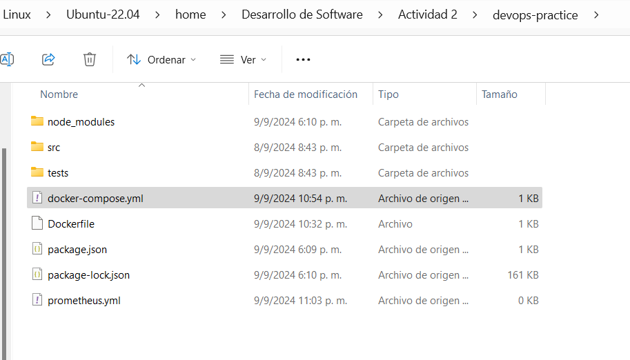

## 1. Preguntas de reflexión:
 **- Pregunta 1:** ¿Qué significa "desplazar a la izquierda" en el contexto de DevSecOps y por qué es importante?
>Significa que la seguridad en un contexto DevSecOps se tiene en cuenta desde el inicio del desarrollo, corrigiendo así errores en las etapas tempranas del mismo. Esto es importante, ya que, además de mejorar la seguridad, se evitan costos adicionales por la corrección de errores de seguridad en las etapas finales del desarrollo.

 **- Pregunta 2:** Explica cómo IaC mejora la consistencia y escalabilidad en la gestión de infraestructuras.
>La Infraestructura como Código (IaC) automatiza la configuración y el aprovisionamiento a través de diversas herramientas de gestión, mejorando así la consistencia y escalabilidad.

 **- Pregunta 3:** ¿Cuál es la diferencia entre monitoreo y observabilidad? ¿Por qué es crucial la observabilidad en sistemas complejos?
 >Mientras que el monitoreo solo se encarga de detectar problemas ya conocidos, la observabilidad es algo más profundo, ya que no solo encuentra el problema, sino que también permite comprender por qué sucede. Esto es importante en sistemas de mayor complejidad, ya que facilita la identificación de cuellos de botella y la optimización del rendimiento.

 **- Pregunta 4:** ¿Cómo puede la experiencia del desarrollador impactar el éxito de DevOps en una organización?
> La experiencia del desarrollador es esencial para el exito de DevOps , ya que al ser productivo,genera impacto en el desarroloo de esta cultura de trabajo libre de silos organizacionales , haciendo que se sienta mas feliz con su labor.

 **- Pregunta 5:** Describe cómo InnerSource puede ayudar a reducir silos dentro de una organización.
>InnerSource reduce los silos ya que consiste en la colaboración al estilo del código abierto, lo cual facilita la resolución de problemas más allá de las fronteras departamentales.

 **- Pregunta 6:** ¿Qué rol juega la ingeniería de plataformas en mejorar la eficiencia y la experiencia del desarrollador?
>La ingeniería de plataformas se centra en construir plataformas internas que integran herramientas, servicios y flujos de trabajo automatizados para manejar tareas repetitivas. Esto ayuda a que los desarrolladores se concentren en tareas de mayor prioridad, mejorando su eficiencia y haciendo que el desarrollo sea una experiencia más productiva.

## 3. Aplicar los conceptos de DevSecOps, IaC, y Observabilidad en un entorno práctico, utilizando herramientas que permiten integrar seguridad, gestionar infraestructura como código, y mejorar la visibilidad del sistema en tiempo real.

**Instrucciones:**
**1. Configuración del entorno**
 1. Inicializa el proyecto de Node.js:
 ~~~
mkdir devops-practice  # Crea un nuevo directorio llamado "devops-practice"
cd devops-practice     # Cambia el directorio actual a "devops-practice"
npm init -y            # Inicializo un nuevo proyecto de Node.js predeterminado y genera un archivo `package.json`
 ~~~

> Como podemos observar, los comandos se ejecutaron de forma correcta, creando el proyecto con las configuraciones predeterminadas.

2. Instalar las dependencias necesarias:
~~~
npm install express jest supertest # Instala las dependencias de Express y Jest en el proyecto.
~~~

> El comando instalo las dependencias de Express y Jest, las cuales consisten en :

>Express: Es un marco de aplicación web minimalista para Node.js. Se utiliza para crear y manejar servidores web, gestionar rutas, manejar solicitudes y respuestas HTTP, y desarrollar aplicaciones web y APIs de manera eficiente y estructurada.

>Jest: Es un framework de pruebas en JavaScript desarrollado por Facebook. Se utiliza para escribir, ejecutar y gestionar pruebas de unidad, pruebas de integración y pruebas de extremo a extremo para asegurar que el código funcione correctamente. Jest es conocido por su facilidad de uso, su configuración mínima y sus capacidades avanzadas, como la generación de informes de cobertura de código y la ejecución de pruebas en paralelo.

3. Crea la estructura del proyecto:
~~~
mkdir src tests                # Crea dos nuevos directorios: "src" para el código fuente y "tests" para las pruebas
touch src/app.js tests/app.test.js  # Crea archivos vacíos "app.js" en el directorio "src" y "app.test.js" en el directorio "tests"
~~~

> Los comandos crearon nuevos directorios tanto para el codigo fuente como para las pruebas.
4. Implementa la API REST en src/app.js:
~~~
const express = require('express');  // Importa el módulo Express
const app = express();  // Crea una instancia de la aplicación Express

app.get('/', (req, res) => {  // Define una ruta GET en la raíz
  res.send('Hello, World!');  // Envía una respuesta de texto 'Hello, World!' al cliente
});

const port = process.env.PORT || 3001;  // Define el puerto en el que la aplicación escuchará

// Solo inicia el servidor si el archivo no es requerido por otro módulo (como en las pruebas)
if (require.main === module) {
  app.listen(port, () => {
    console.log(`Server running on port ${port}`);  // Imprime en la consola un mensaje indicando que el servidor está corriendo
  });
}

// Exporta la aplicación para que puedan ser utilizados en otros módulos, como en pruebas
module.exports = app;
~~~

> Una API REST permite la creación de servicios web que son fáciles de entender, escalar y mantener

5. Escribe un test básico en tests/app.test.js:
~~~
const request = require('supertest');  // Se requiere el módulo supertest para realizar peticiones HTTP en las pruebas
const app = require('../src/app');  // Se requiere la aplicación (app) para poder hacer pruebas sobre ella

let server;  // Variable para almacenar la instancia del servidor

beforeAll(() => {
    server = app.listen(0);  // Inicia el servidor antes de las pruebas
});

describe('GET /', () => {  // Se define un bloque de pruebas que describe el comportamiento de la ruta GET '/'
    it('should return Hello, World!', async () => {  // Caso de prueba que verifica si la respuesta es "Hello, World!"
        const res = await request(app).get('/');  // Se hace una petición GET a la ruta raíz '/'
        expect(res.statusCode).toEqual(200);  // Se espera que el código de estado de la respuesta sea 200 (OK)
        expect(res.text).toBe('Hello, World!');  // Se espera que el texto de la respuesta sea "Hello, World!"
    });
});

afterAll((done) => {
    server.close(done);  // Cierra el servidor al finalizar las pruebas
});
~~~

>Este bloque de código es un test que verifica si la aplicación Express devuelve correctamente la cadena "Hello, World!" cuando se hace una solicitud GET a la ruta raíz /. La prueba utiliza supertest para simular solicitudes HTTP y Jest (implícitamente a través de describe e it) para realizar las afirmaciones sobre el comportamiento de la aplicación.
6. Configura el script de test en package.json:

>package.json - Descripción de Campos

>- **name:** El nombre del proyecto.
>- **version:** La versión actual del proyecto.
>- **scripts:** Comandos personalizados que se pueden ejecutar con npm.
>- **dependencies:** Paquetes necesarios para ejecutar la aplicación.
>- **devDependencies:** Paquetes necesarios solo para el desarrollo y pruebas.

**2. Implementación de DevSecOps**
 - Integración de Seguridad:
 1. Configura una herramienta de análisis de seguridad estática como npm audit para encontrar
vulnerabilidades en las dependencias:
 ~~~
 npm audit  # Escanea dependencias para encontrar vulnerabilidades de seguridad.
 ~~~
 
 2. Automatiza el análisis de seguridad en GitHub Actions:
 - Actualiza el archivo .github/workflows/ci.yml para incluir un paso de seguridad:
 ~~~
 name: CI Pipeline  # Nombre del flujo de trabajo.

on:  # Define los eventos que desencadenan este flujo de trabajo.
  push:  # Ejecuta el flujo de trabajo cuando hay un push.
    branches:  # Especifica en qué ramas se debe ejecutar el flujo de trabajo cuando ocurre un push.
      - main  # El flujo de trabajo se ejecutará solo si el push se realiza a la rama "main".
  pull_request:  # Ejecuta el flujo de trabajo cuando se abre o se actualiza un pull request.
    branches:  # Especifica en qué ramas se debe ejecutar el flujo de trabajo cuando se abre o actualiza un pull request.
      - main  # El flujo de trabajo se ejecutará solo si el pull request está dirigido a la rama "main".

jobs:  # Define los trabajos que se ejecutarán.
  build:  # Nombre del trabajo.
    runs-on: ubuntu-latest  # Especifica el sistema operativo en el que se ejecutará el trabajo.

    steps:  # Define los pasos que se ejecutarán dentro del trabajo.
    - name: Checkout code  # Nombre del paso para clonar el código.
      uses: actions/checkout@v2  # Utiliza la acción de checkout de GitHub para clonar el repositorio en el entorno de trabajo.

    - name: Set up Node.js  # Nombre del paso para configurar Node.js.
      uses: actions/setup-node@v2  # Utiliza la acción de configuración de Node.js en GitHub Actions.
      with:  # Configura parámetros adicionales para la acción.
        node-version: '14'  # Especifica la versión de Node.js que se instalará.

    - name: Install dependencies  # Nombre del paso para instalar dependencias.
      run: |
        cd "Actividad 2/devops-practice"  # Cambia al directorio donde está el proyecto.
        npm install  # Ejecuta el comando 'npm install' para instalar las dependencias del proyecto especificadas en el archivo package.json.

    - name: Run tests  # Nombre del paso para ejecutar pruebas.
      run: |
        cd "Actividad 2/devops-practice"  # Cambia al directorio donde está el proyecto.
        npm test  # Ejecuta el comando 'npm test' para correr las pruebas definidas en el proyecto.

    - name: Run security audit  # Nombre del paso para ejecutar el análisis de seguridad.
      run: |
        cd "Actividad 2/devops-practice"  # Cambia al directorio donde está el proyecto.
        npm audit  # Ejecuta el comando 'npm audit' para escanear las dependencias en busca de vulnerabilidades.
 ~~~
 
 

 **3. Implementación de Infraestructura como Código (IaC)**
 - Usa Docker para contenerizar la aplicación:
 1. Crea un archivo Dockerfile:
 
 

 ~~~
 # Usa la imagen oficial de Node.js
 FROM node:14
 # Establece el directorio de trabajo en el contenedor
 WORKDIR /app
 # Copia los archivos package.json y package-lock.json
 COPY package*.json ./
 # Instala las dependencias
 RUN npm install
 # Copia el resto de los archivos de la aplicación
 COPY . .
 # Expone el puerto en el que la aplicación correrá
 EXPOSE 3001
 # Comando para iniciar la aplicación
 CMD ["node", "src/app.js"]
~~~

> Se configuró el archivo Dockerfile.
2. Construye y corre el contenedor:
 ~~~
docker build -t devops-practice .  # Construye una imagen Docker a partir del Dockerfile en el directorio actual, etiquetándola como devops-practice
docker run -p 3001:3001 devops-practice  # Ejecuta un contenedor basado en la imagen 'devops-practice' y mapea el puerto 3000 del contenedor al puerto 3000 de la máquina local
 ~~~

 > Se construyó con éxito la imagen Docker llamada `devops-practice`.
 - Automatiza la gestión de contenedores usando Docker Compose:
 1. Crea un archivo docker-compose.yml:

 ~~~
 services:  # Define los servicios que Docker Compose gestionará.

  app:  # Nombre del servicio.

    build: .  # Indica que Docker Compose debe construir la imagen Docker utilizando el Dockerfile.

    ports:  # Configura el mapeo de puertos entre el contenedor y tu máquina local.
      - "3001:3001"  # Mapea el puerto 3000 del contenedor al puerto 3000 de tu máquina local.

    environment:  # Define variables de entorno que se pasarán al contenedor cuando se ejecute.
      - NODE_ENV=production  # Configura la variable de entorno 'NODE_ENV' como 'production'. Esto indica que la aplicación debería ejecutarse en modo de producción.
 ~~~

2. Corre la aplicación usando Docker Compose:
 ~~~
docker compose up --build -d  # Construye la imagen Docker (si no está construida o si hay cambios) y luego levanta los servicios definidos en docker-compose.yml en segundo plano (detached mode)
 ~~~

**4. Implementación de Observabilidad**

 - Configura Prometheus y Grafana para monitorear la aplicación:
 1. Crea un archivo prometheus.yml para configurar Prometheus:

 
 

 ~~~
 global:  # Configuración global que afecta a todos los trabajos de scraping en Prometheus.
  scrape_interval: 15s  # Intervalo de tiempo entre cada recolección de métricas (scraping). En este caso, cada 15 segundos.

scrape_configs:  # Define los trabajos de scraping que Prometheus gestionará.
  - job_name: 'node-app'  # Nombre del trabajo de scraping, utilizado para etiquetar y organizar las métricas recolectadas.

    static_configs:  # Configuración estática que define los objetivos (targets) para recolectar métricas.
      - targets: ['app:3000']  # Lista de objetivos. En este caso, Prometheus hará scraping en el servicio 'app' que está expuesto en el puerto 3000.
 ~~~

 

 2. Configura Grafana utilizando un docker-compose.yml actualizado:

 ~~~
services:  # Define los servicios que Docker Compose gestionará.

  app:  # Nombre del servicio para la aplicación.
  
    build: .  # Indica que Docker Compose debe construir la imagen Docker utilizando el Dockerfile en el directorio actual.
    
    ports:  # Configura el mapeo de puertos entre el contenedor y tu máquina local.
      - "3001:3001"  # Mapea el puerto 3000 del contenedor al puerto 3000 de tu máquina local, permitiendo el acceso a la aplicación.

    environment:  # Define variables de entorno que se pasarán al contenedor cuando se ejecute.
      - NODE_ENV=production  # Configura la variable de entorno 'NODE_ENV' como 'production'. Esto indica que la aplicación se ejecutará en modo producción.

  prometheus:  # Nombre del servicio para Prometheus.
  
    image: prom/prometheus  # Especifica la imagen Docker que se usará para el servicio Prometheus (de la imagen oficial de Prometheus en Docker Hub).

    volumes:  # Define volúmenes para montar archivos o directorios del host en el contenedor.
      - ./prometheus.yml:/etc/prometheus/prometheus.yml  # Monta el archivo 'prometheus.yml' desde el directorio actual al contenedor en la ruta '/etc/prometheus/prometheus.yml'. Prometheus lo usará como su archivo de configuración.

    ports:  # Configura el mapeo de puertos para Prometheus.
      - "9090:9090"  # Mapea el puerto 9090 del contenedor (donde Prometheus expone su interfaz) al puerto 9090 de tu máquina local.

  grafana:  # Nombre del servicio para Grafana.
  
    image: grafana/grafana  # Especifica la imagen Docker que se usará para el servicio Grafana (de la imagen oficial de Grafana en Docker Hub).

    ports:  # Configura el mapeo de puertos para Grafana.
      - "3000:3000"  # Mapea el puerto 3001 del contenedor al puerto 3001 de tu máquina local, permitiendo el acceso a la interfaz de Grafana.
 ~~~

**5. Documentación y evaluación**
 - Documenta el proceso seguido, desde la configuración del entorno hasta la integración de seguridad,la gestión de infraestructura como código y la implementación de observabilidad.
>Esto ya se realizó en este documento.

 - Reflexiona sobre la experiencia, discutiendo cómo cada componente contribuye a un flujo de trabajo DevOps más seguro, eficiente y visible.

>En la actividad realizada, cada componente contribuyó a un flujo de trabajo DevOps más seguro, eficiente y visible. La integración de DevSecOps mediante el uso de npm audit en los pipelines permitió identificar vulnerabilidades de seguridad desde el inicio del desarrollo. La implementación de Infraestructura como Código (IaC) con Docker y Docker Compose automatizó la configuración y despliegue, asegurando consistencia y escalabilidad en los entornos. Finalmente, la observabilidad, configurada con Prometheus y Grafana, permitió monitorear el sistema en tiempo real, proporcionando visibilidad total y facilitando la identificación de problemas y optimizaciones en el rendimiento.