## Conceptos básicos de Git: Comienza con una experiencia práctica
**git config: Preséntate a Git**
~~~
git config --list  # Muestra todas las configuraciones de Git que están activas, incluyendo configuraciones a nivel de sistema, usuario y repositorio.
~~~
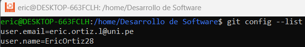
**git init: Donde comienza tu viaje de código**
~~~
mkdir kapumota-repo      # Crea un nuevo directorio llamado "kapumota-repo"
cd kapumota-repo/        # Cambia el directorio de trabajo actual a "kapumota-repo"
git init                 # Inicializa un nuevo repositorio de Git vacío en el directorio actual
~~~
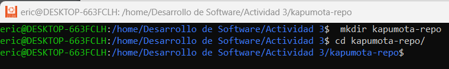

**git add: Preparando tu código**
~~~
echo " README" > README.md   # Crea un archivo llamado README.md con el texto "README" dentro
git status   # Muestra el estado actual del repositorio, incluyendo archivos no rastreados como README.md
git add README.md   # Añade el archivo README.md al área de staging para que sea rastreado por Git
git status   # Muestra el estado actualizado, donde README.md está listo para ser confirmado (committed)
~~~
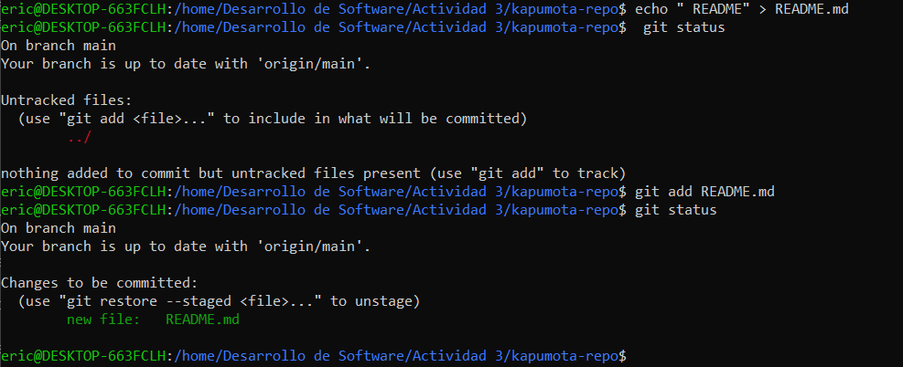
**git commit: registra cambios**
~~~
git commit -m "Initial commit with README.md"   # Realiza un commit con el mensaje "Initial commit with README.md", describiendo los cambios hechos
git status   # Verifica el estado del repositorio; debería mostrar "nothing to commit, working tree clean" si todos los cambios han sido confirmados
~~~
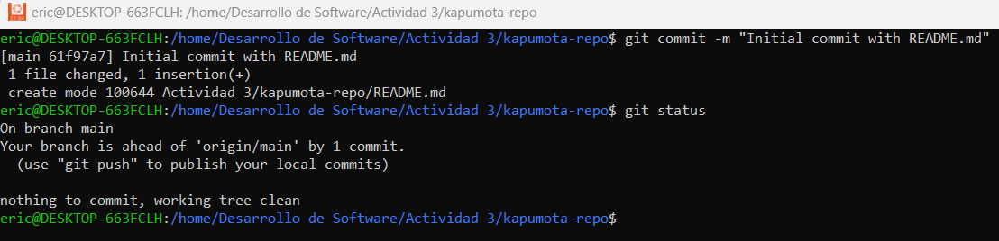
**git log: Recorrer el árbol de commits**
~~~
git log   # Muestra el historial de commits, incluyendo el identificador SHA-1, autor, fecha y mensaje de cada commit.
git log -p   # Muestra las diferencias en cada commit.
git log --stat   # Muestra estadísticas de los archivos modificados.
git log --oneline   # Muestra los commits en una sola línea.
git log --graph   # Visualiza la historia de branches y merges en formato gráfico.
git log --author="EricOrtiz28"   # Filtra los commits por autor.
~~~
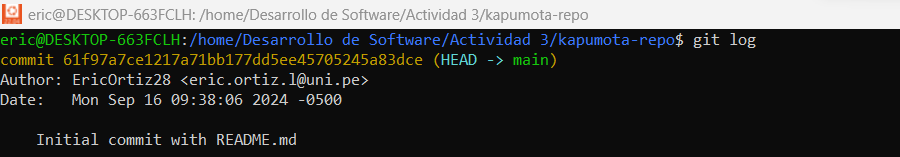
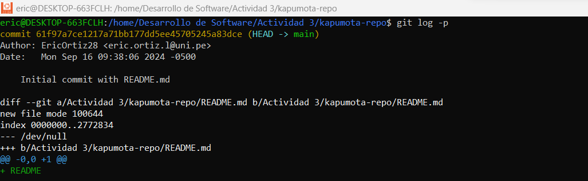
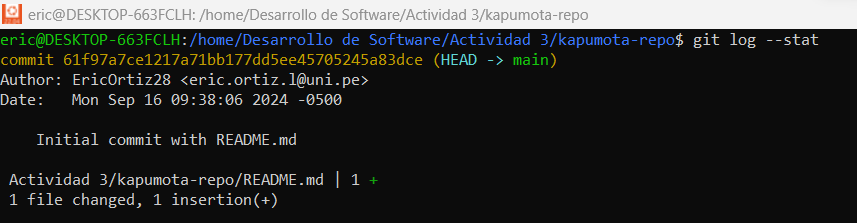
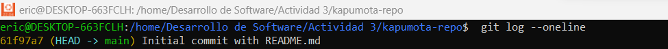
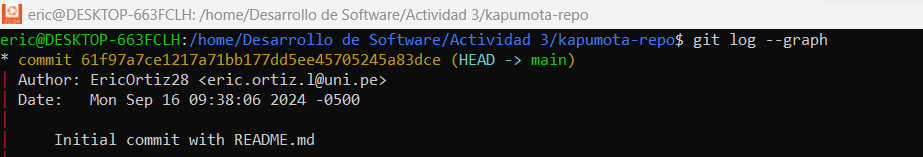
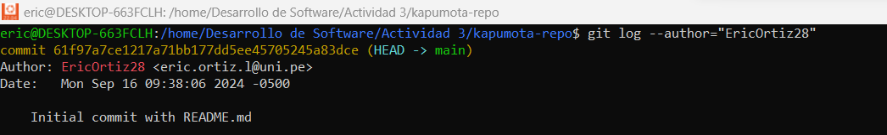
Por ejemplo, también puede mejorar la perspectiva de la siguiente manera:
> git log --graph --pretty=format:'%x09 %h %ar ("%an") %s'

Pregunta: ¿ Cual es la salida de este comando? 

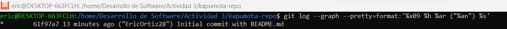

Pregunta: Intentemos el comando git log en este ejercicio
Primero, actualiza el archivo README.md y crea un nuevo archivo
CONTRIBUTING.md:
~~~
echo " CONTRIBUTING" > CONTRIBUTING.md   # Crea un archivo CONTRIBUTING.md con el texto "CONTRIBUTING" dentro
echo " README\n\nWelcome to the project" > README.md   # Sobrescribe el archivo README.md con el texto "README" seguido de "Welcome to the project"
git add .   # Añade todos los archivos y cambios del directorio actual al área de staging
git commit -m "Set up the repository base documentation"   # Realiza un commit con el mensaje "Set up the repository base documentation"
~~~
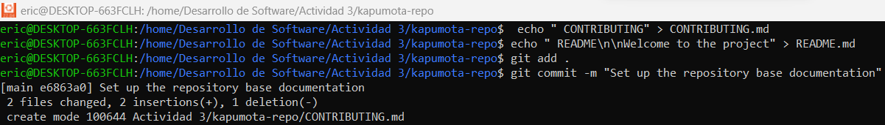

Una vez hecho, agrega un código de ejemplo en Python:

~~~
echo "print('Hello World')" > main.py   # Crea un archivo main.py con el código para imprimir "Hello World"
git add .   # Añade todos los archivos y cambios en el directorio actual al área de staging
git commit -m "Add main.py"   # Realiza un commit con el mensaje "Add main.py" describiendo la adición del archivo
~~~
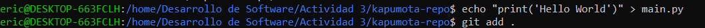
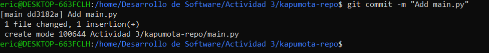
Cuando se confirme en el log que está correctamente registrado, está hecho:

~~~
git log --oneline   # Muestra el historial de commits de forma compacta, donde cada commit se presenta en una sola línea con su identificador SHA-1 corto y el mensaje del commit.
~~~

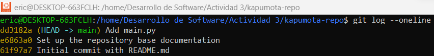

## Trabajar con branches: La piedra angular de la colaboración
~~~
git branch   # Muestra una lista de todas las ramas locales del repositorio, resaltando con un asterisco (*) la rama actual en la que te encuentras.
~~~
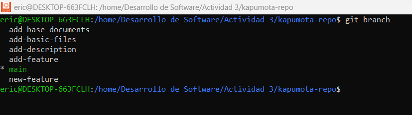
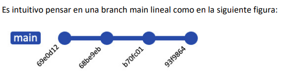
Puedes crear una nueva branch a partir de la branch actual:
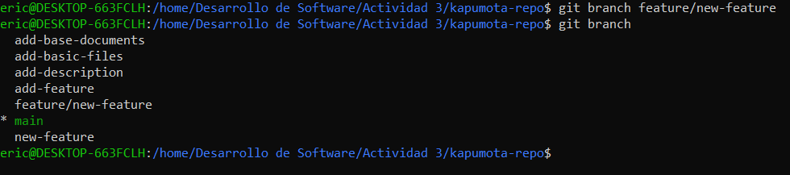
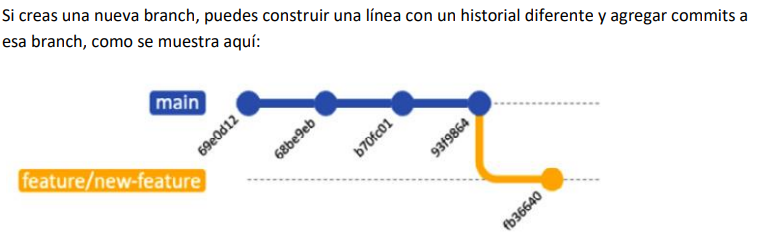
También puedes crear una branch a partir de una branch o commit específico:
~~~
git branch rama feature/new-feature   # Crea una nueva rama llamada "rama" a partir de la rama "feature/new-feature".
~~~
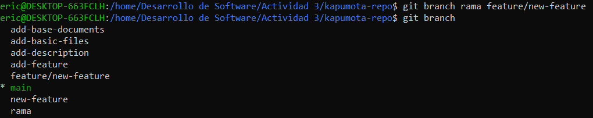
~~~
git branch rama-commit e6863a0   # Crea una nueva rama llamada "rama-commit" a partir del commit con el hash "e6863a0".
~~~
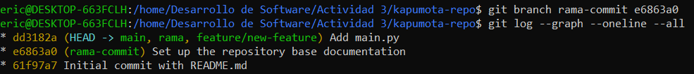
**git checkout/git switch: Cambiar entre branches**
~~~
git checkout feature/new-feature   # Cambia a la rama "feature/new-feature", actualizando el directorio de trabajo a esa rama.
~~~
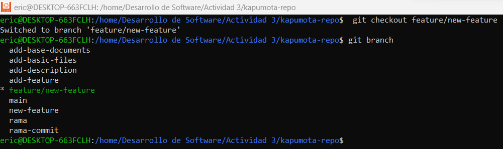
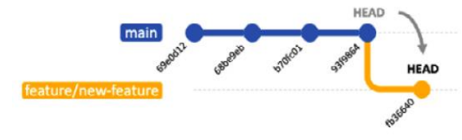
**Ejemplos adicionales:**
**Crear una brach desde una branch específica**
>Completado en los puntos previos

Para crear una nueva branch y cambiar a ella en un solo paso, puedes usar el comando git checkout -b:
~~~
git checkout -b add-description   # Crea una nueva rama llamada "add-description" y cambia a esa rama inmediatamente.
~~~
Este comando es equivalente a ejecutar los siguientes dos comandos por separado:
~~~
git branch add-description # Crea una nueva rama llamada "add-description".
git checkout add-description # Cambia a la nueva rama "add-description"
~~~
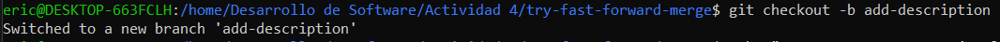
**git merge : Fusionando branches**
~~~
git checkout main   # Cambia a la rama principal 'main'
git branch   # Lista todas las ramas locales, indicando la rama actual con un asterisco
git merge add-description   # Fusiona la rama 'add-description' en la rama 'main', si hay cambios pendientes; en este caso ya está actualizada
~~~
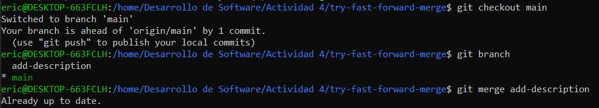
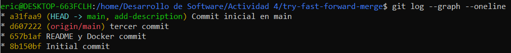
**git branch -d: Eliminando una Branch**
~~~
git branch -d feature/new-feature   # Elimina la rama local 'feature/new-feature' si ya ha sido fusionada o no tiene cambios pendientes
~~~
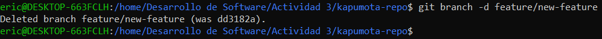