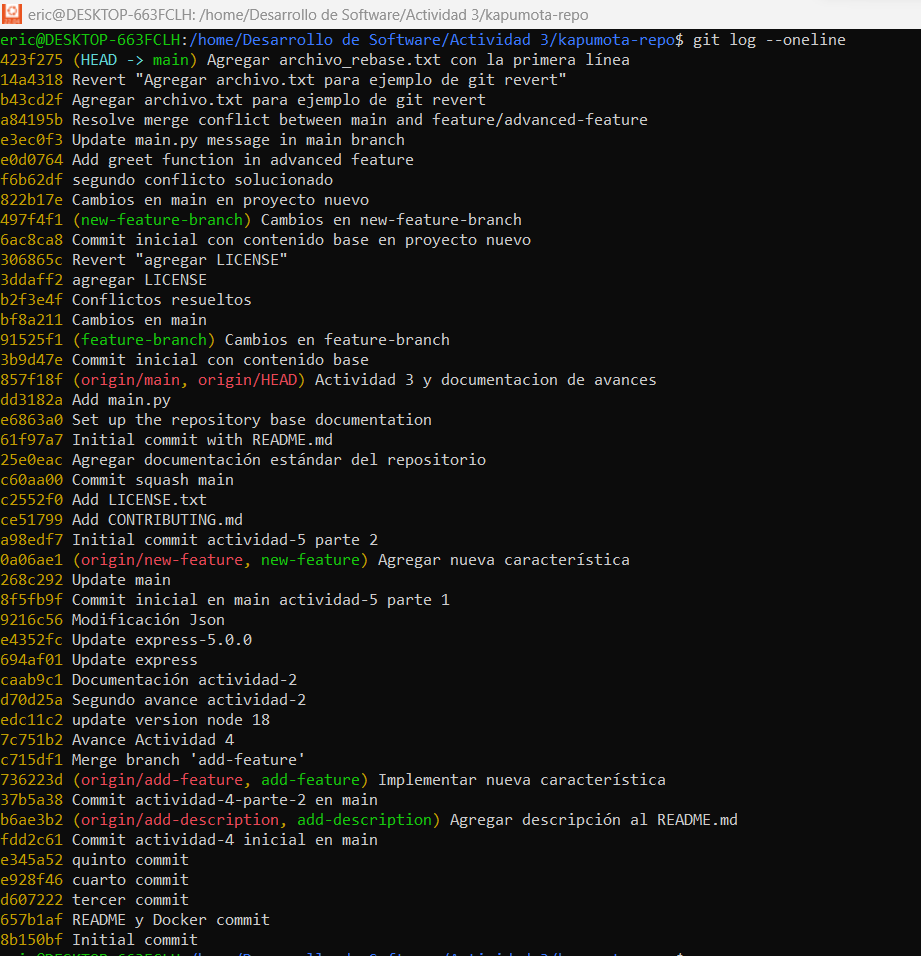
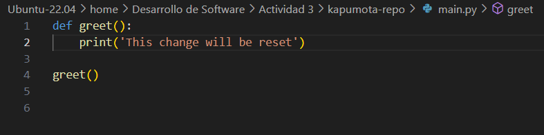
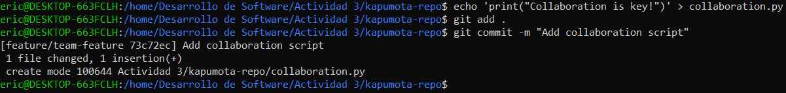

## Conceptos básicos de Git: Comienza con una experiencia práctica
**git config: Preséntate a Git**
~~~
git config --list  # Muestra todas las configuraciones de Git que están activas, incluyendo configuraciones a nivel de sistema, usuario y repositorio.
~~~

**git init: Donde comienza tu viaje de código**
~~~
mkdir kapumota-repo      # Crea un nuevo directorio llamado "kapumota-repo"
cd kapumota-repo/        # Cambia el directorio de trabajo actual a "kapumota-repo"
git init                 # Inicializa un nuevo repositorio de Git vacío en el directorio actual
~~~

**git add: Preparando tu código**
~~~
echo " README" > README.md   # Crea un archivo llamado README.md con el texto "README" dentro
git status   # Muestra el estado actual del repositorio, incluyendo archivos no rastreados como README.md
git add README.md   # Añade el archivo README.md al área de staging para que sea rastreado por Git
git status   # Muestra el estado actualizado, donde README.md está listo para ser confirmado (committed)
~~~

**git commit: registra cambios**
~~~
git commit -m "Initial commit with README.md"   # Realiza un commit con el mensaje "Initial commit with README.md", describiendo los cambios hechos
git status   # Verifica el estado del repositorio; debería mostrar "nothing to commit, working tree clean" si todos los cambios han sido confirmados
~~~

**git log: Recorrer el árbol de commits**
~~~
git log   # Muestra el historial de commits, incluyendo el identificador SHA-1, autor, fecha y mensaje de cada commit.
git log -p   # Muestra las diferencias en cada commit.
git log --stat   # Muestra estadísticas de los archivos modificados.
git log --oneline   # Muestra los commits en una sola línea.
git log --graph   # Visualiza la historia de branches y merges en formato gráfico.
git log --author="EricOrtiz28"   # Filtra los commits por autor.
~~~

Por ejemplo, también puede mejorar la perspectiva de la siguiente manera:
> git log --graph --pretty=format:'%x09 %h %ar ("%an") %s'

Pregunta: ¿ Cual es la salida de este comando? 

Pregunta: Intentemos el comando git log en este ejercicio
Primero, actualiza el archivo README.md y crea un nuevo archivo
CONTRIBUTING.md:
~~~
echo " CONTRIBUTING" > CONTRIBUTING.md   # Crea un archivo CONTRIBUTING.md con el texto "CONTRIBUTING" dentro
echo " README\n\nWelcome to the project" > README.md   # Sobrescribe el archivo README.md con el texto "README" seguido de "Welcome to the project"
git add .   # Añade todos los archivos y cambios del directorio actual al área de staging
git commit -m "Set up the repository base documentation"   # Realiza un commit con el mensaje "Set up the repository base documentation"
~~~

Una vez hecho, agrega un código de ejemplo en Python:

~~~
echo "print('Hello World')" > main.py   # Crea un archivo main.py con el código para imprimir "Hello World"
git add .   # Añade todos los archivos y cambios en el directorio actual al área de staging
git commit -m "Add main.py"   # Realiza un commit con el mensaje "Add main.py" describiendo la adición del archivo
~~~

Cuando se confirme en el log que está correctamente registrado, está hecho:

~~~
git log --oneline   # Muestra el historial de commits de forma compacta, donde cada commit se presenta en una sola línea con su identificador SHA-1 corto y el mensaje del commit.
~~~

## Trabajar con branches: La piedra angular de la colaboración
~~~
git branch   # Muestra una lista de todas las ramas locales del repositorio, resaltando con un asterisco (*) la rama actual en la que te encuentras.
~~~

Puedes crear una nueva branch a partir de la branch actual:

También puedes crear una branch a partir de una branch o commit específico:
~~~
git branch rama feature/new-feature   # Crea una nueva rama llamada "rama" a partir de la rama "feature/new-feature".
~~~

~~~
git branch rama-commit e6863a0   # Crea una nueva rama llamada "rama-commit" a partir del commit con el hash "e6863a0".
~~~

**git checkout/git switch: Cambiar entre branches**
~~~
git checkout feature/new-feature   # Cambia a la rama "feature/new-feature", actualizando el directorio de trabajo a esa rama.
~~~

**Ejemplos adicionales:**
**Crear una brach desde una branch específica**
>Completado en los puntos previos

Para crear una nueva branch y cambiar a ella en un solo paso, puedes usar el comando git checkout -b:
~~~
git checkout -b add-description   # Crea una nueva rama llamada "add-description" y cambia a esa rama inmediatamente.
~~~
Este comando es equivalente a ejecutar los siguientes dos comandos por separado:
~~~
git branch add-description # Crea una nueva rama llamada "add-description".
git checkout add-description # Cambia a la nueva rama "add-description"
~~~

**git merge : Fusionando branches**
~~~
git checkout main   # Cambia a la rama principal 'main'
git branch   # Lista todas las ramas locales, indicando la rama actual con un asterisco
git merge add-description   # Fusiona la rama 'add-description' en la rama 'main', si hay cambios pendientes; en este caso ya está actualizada
~~~

**git branch -d: Eliminando una Branch**
~~~
git branch -d feature/new-feature   # Elimina la rama local 'feature/new-feature' si ya ha sido fusionada o no tiene cambios pendientes
~~~

Preguntas:
• ¿Cómo te ha ayudado Git a mantener un historial claro y organizado de tus cambios?
> A través de los diferentes commits, que me permiten mantener un registro claro y organizado de los cambios que voy realizando.

• ¿Qué beneficios ves en el uso de branches para desarrollar nuevas características o corregir errores?
> El beneficio es que se pueden probar los diversos cambios antes de que se incorporen a la rama principal (main), lo que facilita el trabajo colaborativo.

• Realiza una revisión final del historial de commits para asegurarte de que todos los cambios se han registrado correctamente.

• Revisa el uso de branches y merges para ver cómo Git maneja múltiples líneas de desarrollo.

**Ejercicios**
Ejercicio 1: Manejo avanzado de branches y resolución de conflictos
Instrucciones:
1. Crear una nueva rama para una característica:
- Crea una nueva rama llamada feature/advanced-feature desde la rama main:
~~~
git branch feature/advanced-feature   # Crea una nueva rama llamada 'feature/advanced-feature' desde la rama main
git checkout feature/advanced-feature   # Cambia a la rama 'feature/advanced-feature'
~~~

2. Modificar archivos en la nueva rama:
 - Edita el archivo main.py para incluir una función adicional:

  - Añade y confirma estos cambios en la rama feature/advanced-feature:
~~~
git add main.py   # Agrega el archivo main.py al área de preparación
git commit -m "Add greet function in advanced feature"   # Realiza un commit de los cambios en la rama feature/advanced-feature
~~~

3. Simular un desarrollo paralelo en la rama main:
 - Cambia de nuevo a la rama main:
~~~
git checkout main   # Cambia a la rama 'main'
~~~

- Edita el archivo main.py de forma diferente (por ejemplo, cambia el mensaje del print original):

 - Añade y confirma estos cambios en la rama main:
~~~
git add main.py   # Agrega el archivo main.py al área de preparación
git commit -m "Update main.py message in main branch"   # Realiza un commit con los cambios de main.py en la rama main
~~~

 4. Intentar fusionar la rama feature/advanced-feature en main:
~~~
git merge feature/advanced-feature   # Intenta fusionar la rama 'feature/advanced-feature' con 'main', lo que genera un conflicto
~~~

 5. Resolver el conflicto de fusión:
 - Git generará un conflicto en main.py. Abre el archivo y resuelve el conflicto manualmente,eligiendo cómo combinar las dos versiones.

 - Después de resolver el conflicto, añade el archivo resuelto y completa la fusión:
~~~
git add main.py   # Añade el archivo main.py después de resolver el conflicto
git commit -m "Resolve merge conflict between main and feature/advanced-feature"   # Confirma la resolución del conflicto
~~~

 
 

 6. Eliminar la rama fusionada:
 - Una vez que hayas fusionado con éxito y resuelto los conflictos, elimina la rama
feature/advanced-feature:
~~~
git branch -d feature/advanced-feature   # Elimina la rama local 'feature/advanced-feature' después de fusionarla correctamente
~~~

Ejercicio 2: Exploración y manipulación del historial de commits
Objetivo: Aprender a navegar y manipular el historial de commits usando comandos avanzados de Git.

Instrucciones:
1. Ver el historial detallado de commits:
 - Usa el comando git log para explorar el historial de commits, pero esta vez con más detalle:
~~~
git log -p   # Muestra el historial de commits con las diferencias detalladas para cada commit
~~~

 

 - Examina las diferencias introducidas en cada commit. ¿Qué cambios fueron realizados en cada uno?
>En el commit "Add greet function in advanced feature", se añadió un cambio en el archivo main.py en la rama feature/advanced-feature. En el commit "Update main.py message in main branch", se hizo otro cambio sobre el mismo archivo, pero desde la rama main. Finalmente, en el commit "Resolve merge conflict between main and feature/advanced-feature", se resolvió el conflicto que había entre ambas ramas, eligiendo el cambio de la rama feature/advanced-feature como el código deseado.

2. Filtrar commits por autor:
 - Usa el siguiente comando para mostrar solo los commits realizados por un autor específico:
~~~
git log --author="TuNombre"   # Filtra y muestra solo los commits realizados por el autor especificado
~~~

3. Revertir un commit:
 - Imagina que el commit más reciente en main.py no debería haberse hecho. Usa git revert para revertir ese commit:
~~~
git revert HEAD   # Revierte el último commit en la rama actual, añadiendo un nuevo commit que anula los cambios
~~~

- Verifica que el commit de reversión ha sido añadido correctamente al historial

4. Rebase interactivo:
 - Realiza un rebase interactivo para combinar varios commits en uno solo. Esto es útil para limpiar
el historial de commits antes de una fusión.
 - Usa el siguiente comando para empezar el rebase interactivo:
~~~
git rebase -i HEAD~3   # Inicia un rebase interactivo para los últimos 3 commits
~~~

- En el editor que se abre, combina los últimos tres commits en uno solo utilizando la opción squash.

5. Visualización gráfica del historial:
 - Usa el siguiente comando para ver una representación gráfica del historial de commits:
~~~
git log --graph --oneline --all   # Muestra una representación gráfica del historial de commits en el repositorio
~~~

 

 - Reflexiona sobre cómo el historial de tu proyecto se visualiza en este formato. ¿Qué información adicional puedes inferir?
>Ahora se muestran las diversas operaciones realizadas con las ramas que he ido creando.

Ejercicio 3: Creación y gestión de branches desde commits específicos
Objetivo: Practicar la creación de ramas desde commits específicos y comprender cómo Git maneja
las referencias históricas.
Instrucciones:
1. Crear una nueva rama desde un commit específico:
- Usa el historial de commits (git log --oneline) para identificar un commit antiguo desde el cual crear una nueva rama:
~~~
git log --oneline   # Muestra el historial de commits en una línea por commit para identificar el commit desde el que crear una rama
~~~

- Crea una nueva rama bugfix/rollback-feature desde ese commit:
~~~
git branch bugfix/rollback-feature <commit-hash>   # Crea una nueva rama llamada 'bugfix/rollback-feature' desde un commit específico
git checkout bugfix/rollback-feature   # Cambia a la nueva rama 'bugfix/rollback-feature'
~~~

2. Modificar y confirmar cambios en la nueva rama:
 - Realiza algunas modificaciones en main.py que simulen una corrección de errores:

- Añade y confirma los cambios en la nueva rama:
~~~
git add main.py   # Agrega el archivo al área de preparación
git commit -m "Fix bug in rollback feature"   # Realiza un commit con la corrección del error
~~~

3. Fusionar los cambios en la rama principal:
 - Cambia de nuevo a la rama main y fusiona la rama bugfix/rollback-feature:
~~~
git checkout main   # Cambia a la rama 'main'
git merge bugfix/rollback-feature   # Fusiona la rama 'bugfix/rollback-feature' en la rama 'main'
~~~

4. Explorar el historial después de la fusión:
 - Usa git log y git log --graph para ver cómo se ha integrado el commit en el historial:
~~~
git log --graph --oneline   # Muestra el historial gráfico de commits, incluyendo la fusión
~~~

5. Eliminar la rama bugfix/rollback-feature:
 - Una vez fusionados los cambios, elimina la rama bugfix/rollback-feature:
~~~
git branch -d bugfix/rollback-feature   # Elimina la rama 'bugfix/rollback-feature' después de fusionarla
~~~

Ejercicio 4: Manipulación y restauración de commits con git reset y git restore
Objetivo: Comprender cómo usar git reset y git restore para deshacer cambios en el historial y en el
área de trabajo.
Instrucciones:

1. Hacer cambios en el archivo main.py:
 - Edita el archivo main.py para introducir un nuevo cambio:

- Añade y confirma los cambios:
~~~
git add main.py   # Añade el archivo al área de preparación
git commit -m "Introduce a change to be reset"   # Realiza un commit de los cambios en main.py
~~~

2. Usar git reset para deshacer el commit:
 - Deshaz el commit utilizando git reset para volver al estado anterior:
~~~
git reset --hard HEAD~1   # Deshace el último commit, eliminándolo del historial y restaurando el estado anterior del archivo
~~~

- Verifica que el commit ha sido eliminado del historial y que el archivo ha vuelto a su estado anterior.

3. Usar git restore para deshacer cambios no confirmados:
 - Realiza un cambio en README.md y no lo confirmes:
~~~
echo "Another line in README" >> README.md   # Realiza un cambio en README.md sin confirmar
git status   # Verifica el estado actual del área de trabajo
~~~

- Usa git restore para deshacer este cambio no confirmado:
~~~
git restore README.md   # Deshace los cambios no confirmados en README.md
~~~

- Verifica que el cambio no confirmado ha sido revertido.

Ejercicio 5: Trabajo colaborativo y manejo de Pull Requests
Objetivo: Simular un flujo de trabajo colaborativo utilizando ramas y pull requests.
Instrucciones:

1. Usar mi repositorio remoto:
~~~
git clone <URL-del-repositorio>   # Clona el repositorio remoto especificado en tu máquina local
~~~
2. Crear una nueva rama para desarrollo de una característica:
- En tu repositorio local, crea una nueva rama feature/team-feature:
~~~
git branch feature/team-feature   # Crea una nueva rama 'feature/team-feature' para el desarrollo de una característica
git checkout feature/team-feature   # Cambia a la rama 'feature/team-feature'
~~~

3. Realizar cambios y enviar la rama al repositorio remoto:
 - Realiza cambios en los archivos del proyecto y confírmalos:
~~~
echo "print('Collaboration is key!')" > collaboration.py   # Añade un nuevo archivo con un script de colaboración
git add .   # Añade todos los archivos al área de preparación
git commit -m "Add collaboration script"   # Realiza un commit con los cambios
~~~

 - Envía la rama al repositorio remoto:
~~~
git push origin feature/team-feature   # Envía la rama 'feature/team-feature' al repositorio remoto
~~~

 

 4. Abrir un Pull Request:
 - Abre un Pull Request (PR) en la plataforma remota (GitHub/GitLab) para fusionar feature/teamfeature con la rama main.

 - Añade una descripción detallada del PR, explicando los cambios realizados y su propósito.

 

 5. Revisar y Fusionar el Pull Request:
 - Simula la revisión de código, comenta en el PR y realiza cualquier cambio necesario basado en la retroalimentación.

- Una vez aprobado, fusiona el PR en la rama main.

6. Eliminar la rama remota y local:
 - Después de la fusión, elimina la rama tanto local como remotamente:
~~~
git branch -d feature/team-feature   # Elimina la rama local 'feature/team-feature'
git push origin --delete feature/team-feature   # Elimina la rama remota 'feature/team-feature'
~~~

Ejercicio 6: Cherry-Picking y Git Stash
Objetivo: Aprender a aplicar commits específicos a otra rama utilizando git cherry-pick y a guardar
temporalmente cambios no confirmados utilizando git stash.
Instrucciones:
1. Hacer cambios en main.py y confirmarlos:
 - Realiza y confirma varios cambios en main.py en la rama main:
~~~
echo "print('Cherry pick this!')" >> main.py   # Añade una línea en el archivo main.py
git add main.py   # Añade el archivo al área de preparación
git commit -m "Add cherry-pick example"   # Realiza un commit con los cambios
~~~

2. Crear una nueva rama y aplicar el commit específico:
 - Crea una nueva rama feature/cherry-pick y aplícale el commit específico:
~~~
git branch feature/cherry-pick   # Crea una nueva rama llamada 'feature/cherry-pick'
git checkout feature/cherry-pick   # Cambia a la rama 'feature/cherry-pick'
git cherry-pick <commit-hash>   # Aplica el commit específico en la nueva rama usando cherry-pick
~~~

3. Guardar temporalmente cambios no confirmados:
 - Realiza algunos cambios en main.py pero no los confirmes:
~~~
echo "This change is stashed" >> main.py   # Realiza un cambio en main.py pero no lo confirmes
~~~

- Guarda temporalmente estos cambios utilizando git stash:
~~~
git stash   # Guarda temporalmente los cambios no confirmados
~~~

4. Aplicar los cambios guardados:
 - Realiza otros cambios y confírmalos si es necesario.
 - Luego, recupera los cambios guardados anteriormente:
~~~
git stash pop   # Recupera los cambios guardados previamente y los aplica en el área de trabajo actual
~~~

5. Revisar el historial y confirmar la correcta aplicación de los cambios:
 - Usa git log para revisar el historial de commits y verificar que todos los cambios se han aplicado correctamente.
~~~
git log --graph --oneline --all   # Revisa el historial de commits para verificar que los cambios se han aplicado correctamente
~~~

