## 1. Fusión Fast-forward (git merge --ff)
>La fusión fast-forward es la forma más simple de combinar ramas en Git. Solo es posible cuando la rama base no ha recibido nuevos commits desde que se creó la rama feature.

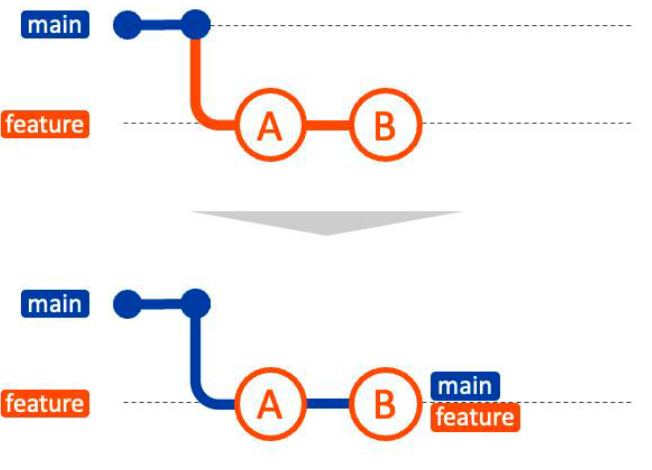

**Crear una nueva carpeta**
~~~
mkdir try-fast-forward-merge  # Crea un nuevo directorio llamado 'try-fast-forward-merge'.
cd try-fast-forward-merge     # Cambia el directorio de trabajo al nuevo directorio 'try-fast-forward-merge'.
~~~

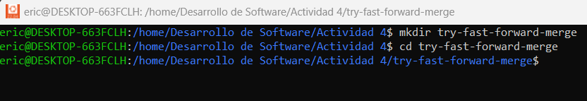

**Agregar un archivo inicial en la rama principal (main)**
~~~
echo "# Mi Proyecto" > README.md  # Crea un archivo 'README.md' con el contenido "# Mi Proyecto".
git add README.md                 # Agrega el archivo 'README.md' al área de preparación (stage).
git commit -m "Commit inicial en main"  # Realiza el primer commit en la rama 'main' con el mensaje "Commit inicial en main".
~~~

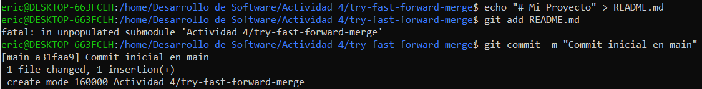
**Crear y cambiar a una nueva rama 'add-description'**
~~~
git checkout -b add-description   # Crea una nueva rama llamada 'add-description' y cambia a esa rama.

~~~
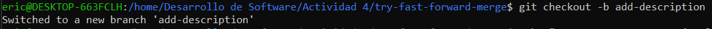
**Hacer cambios en la nueva rama y comitearlos**
~~~
echo "Este proyecto es un ejemplo de cómo usar Git." >> README.md  # Añade una línea de descripción al archivo 'README.md'.
git add README.md                 # Agrega el archivo modificado 'README.md' al área de preparación (stage).
git commit -m "Agregar descripción al README.md"  # Realiza un commit en la rama 'add-description' con el mensaje "Agregar descripción al README.md".

~~~
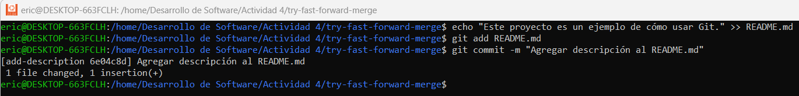
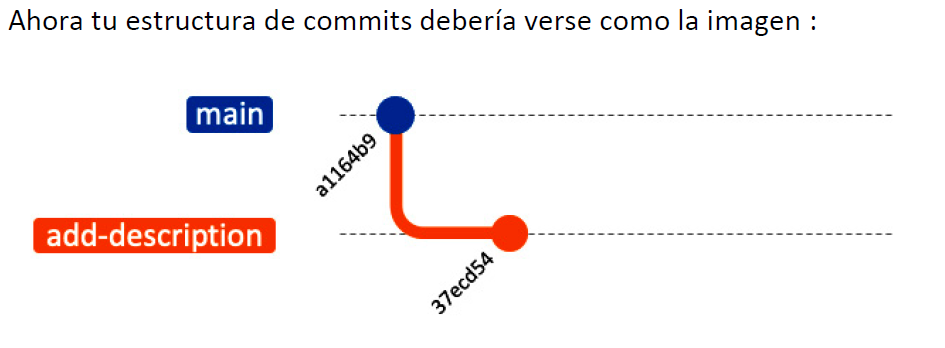
**Cambiar de vuelta a la rama 'main' y realizar la fusión fast-forward**
~~~
git checkout main   # Cambia de vuelta a la rama 'main'.
git merge add-description   # Realiza una fusión fast-forward de la rama 'add-description' a la rama 'main'.
~~~
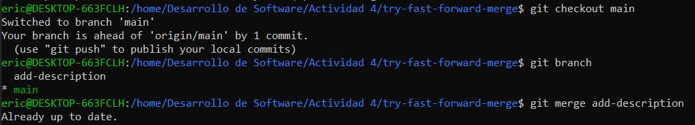
**Ver el historial lineal**
~~~
git log --graph --oneline   # Muestra el historial de commits de manera gráfica y en una línea, para verificar el historial lineal.
~~~
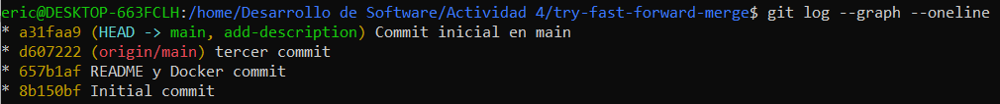
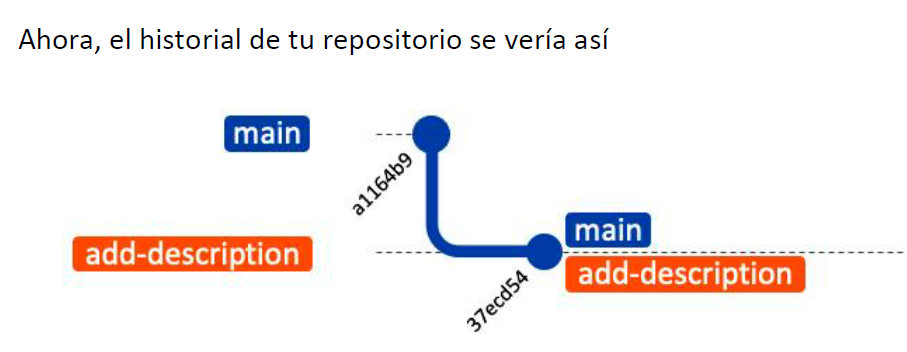
## 2. Fusión No-fast-forward (git merge --no-ff)
>La fusión no-fast-forward crea un nuevo commit de fusión. Es útil para preservar el contexto de la fusión, especialmente en equipos donde se requiere más claridad en el historial de cambios.

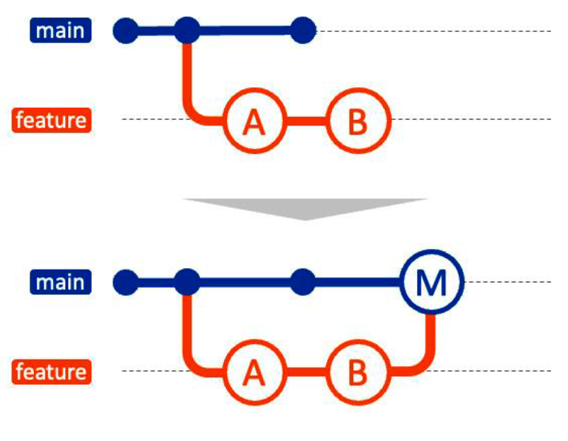

**Crear una nueva carpeta**
~~~
mkdir try-no-fast-forward-merge  # Crea un nuevo directorio llamado 'try-no-fast-forward-merge'.
cd try-no-fast-forward-merge     # Cambia el directorio de trabajo al nuevo directorio 'try-no-fast-forward-merge'.
~~~
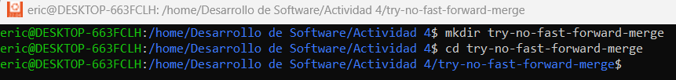
**Agregar un archivo inicial en la rama principal (main)**
~~~
echo "# Mi Proyecto" > README.md  # Crea un archivo 'README.md' con el contenido "# Mi Proyecto".
git add README.md                 # Agrega el archivo 'README.md' al área de preparación (stage).
git commit -m "Commit inicial en main"  # Realiza el primer commit en la rama 'main' con el mensaje "Commit inicial en main".
~~~
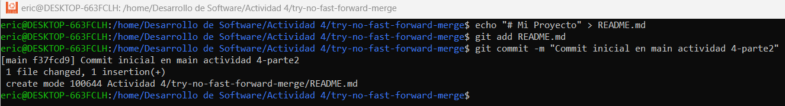
**Crear y cambiar a una nueva rama 'add-feature'**
~~~
git checkout -b add-feature   # Crea una nueva rama llamada 'add-feature' y cambia a esa rama.
~~~
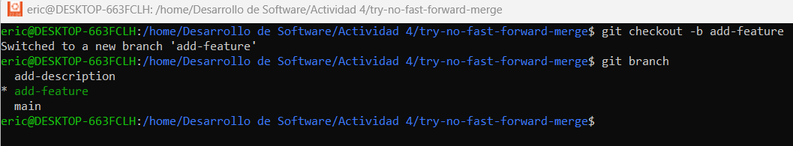
**Hacer cambios en la nueva rama y comitearlos**
~~~
echo "Implementando una nueva característica..." >> README.md  # Añade una línea de descripción al archivo 'README.md'.
git add README.md                 # Agrega el archivo modificado 'README.md' al área de preparación (stage).
git commit -m "Implementar nueva característica"  # Realiza un commit en la rama 'add-feature' con el mensaje "Implementar nueva característica".
~~~
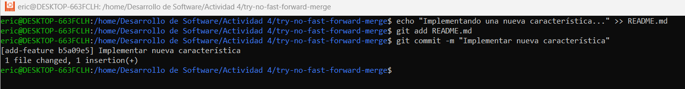
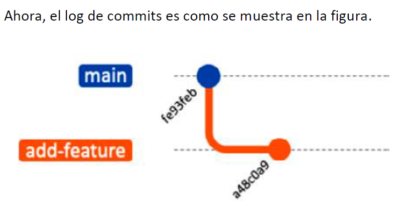
**Cambiar de vuelta a la rama 'main' y realizar una fusión no-fast-forward**
~~~
git checkout main   # Cambia de vuelta a la rama 'main'.
git merge --no-ff add-feature   # Realiza una fusión no-fast-forward de la rama 'add-feature' a la rama 'main'.
~~~
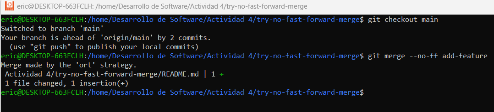

**Después de la edición, veamos el log ahora:**
**Ver el historial**
~~~
git log --graph --oneline   # Muestra el historial de commits de manera gráfica y en una línea, para verificar el historial.
~~~
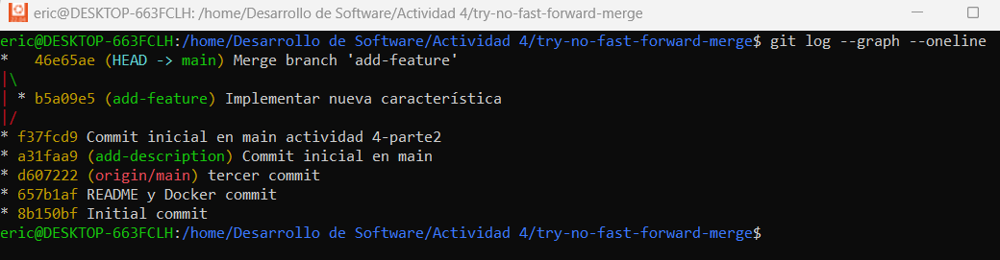
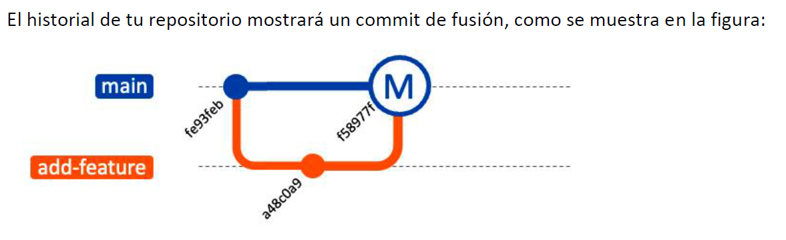
## 3. Fusión squash (git merge --squash)
>La fusión squash combina todos los cambios de una rama en un solo commit en la rama principal. Este método es útil cuando se quiere mantener un historial de commits limpio.

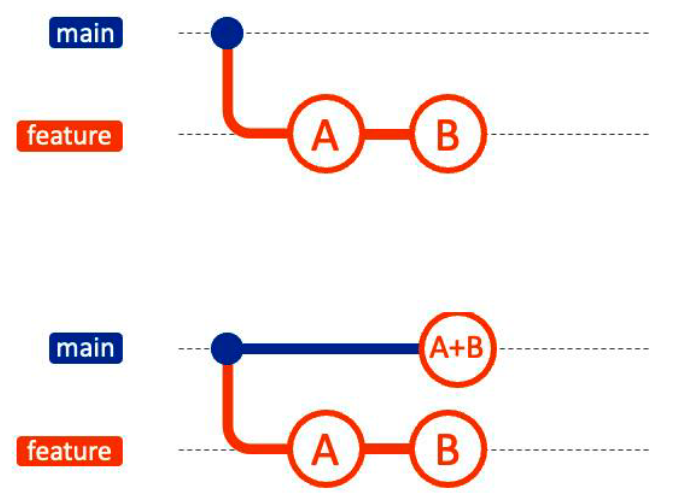

**Crear una nueva carpeta**
~~~
mkdir try-squash-merge  # Crea un nuevo directorio llamado 'try-squash-merge'.
cd try-squash-merge     # Cambia el directorio de trabajo al nuevo directorio 'try-squash-merge'.
~~~
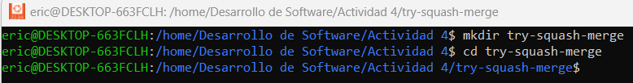
**Agregar un archivo inicial en la rama principal (main)**
~~~
echo "# Mi Proyecto" > README.md  # Crea un archivo 'README.md' con el contenido "# Mi Proyecto".
git add README.md                 # Agrega el archivo 'README.md' al área de preparación (stage).
git commit -m "Commit inicial en main"  # Realiza el primer commit en la rama 'main' con el mensaje "Commit inicial en main".
~~~
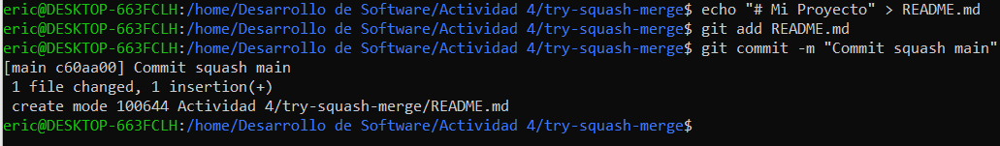
**Crear y cambiar a una nueva rama 'add-basic-files'**
~~~
git checkout -b add-basic-files   # Crea una nueva rama llamada 'add-basic-files' y cambia a esa rama.
~~~
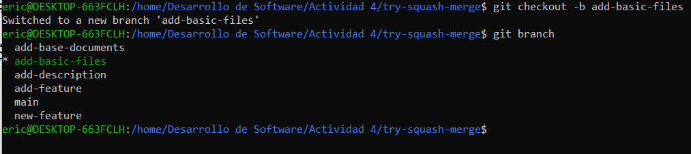
**Hacer algunos cambios y comitearlos**
~~~
echo "# CÓMO CONTRIBUIR" >> CONTRIBUTING.md  # Crea un archivo 'CONTRIBUTING.md' con el contenido "# CÓMO CONTRIBUIR".
git add CONTRIBUTING.md                      # Agrega el archivo 'CONTRIBUTING.md' al área de preparación (stage).
git commit -m "Agregar CONTRIBUTING.md"      # Realiza un commit con el mensaje "Agregar CONTRIBUTING.md".

echo "# LICENCIA" >> LICENSE.txt  # Crea un archivo 'LICENSE.txt' con el contenido "# LICENCIA".
git add LICENSE.txt               # Agrega el archivo 'LICENSE.txt' al área de preparación (stage).
git commit -m "Agregar LICENSE.txt"  # Realiza un commit con el mensaje "Agregar LICENSE.txt".
~~~
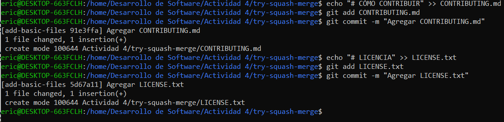
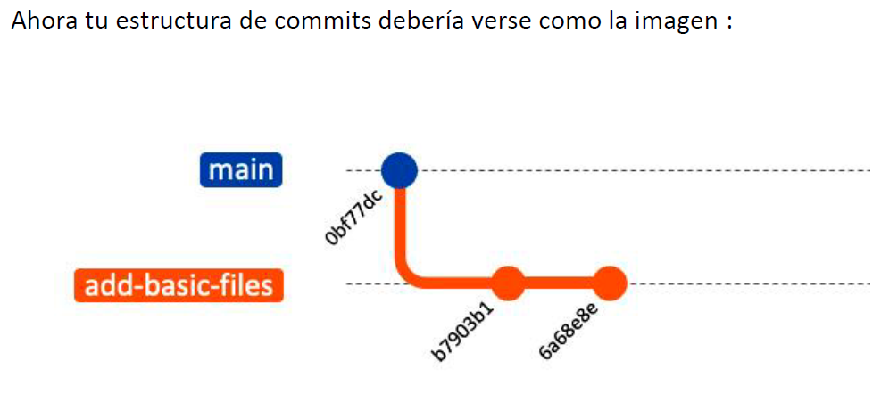
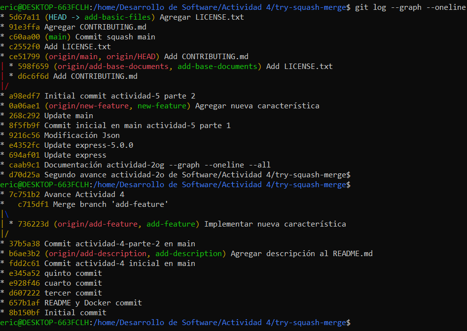
**Cambiar de vuelta a la rama 'main' y realizar la fusión squash**
~~~
git checkout main   # Cambia de vuelta a la rama 'main'.
git merge --squash add-basic-files   # Realiza una fusión squash de la rama 'add-basic-files' a la rama 'main'.
~~~
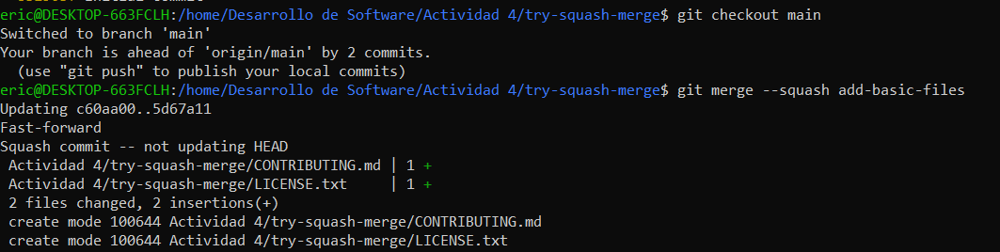
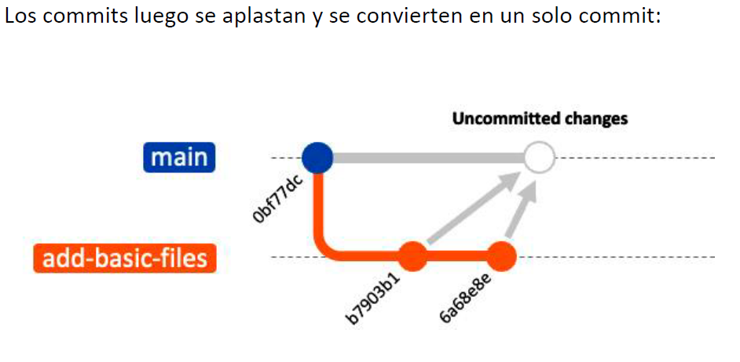
Para completar la fusión squash, realiza un commit:
~~~
git add .   # Agrega todos los archivos al área de preparación (stage).
git commit -m "Agregar documentación estándar del repositorio"  # Realiza un commit consolidado con el mensaje "Agregar documentación estándar del repositorio".
git log --graph --oneline --all   # Muestra el historial de commits de manera gráfica y compacta, incluyendo todas las ramas.
~~~
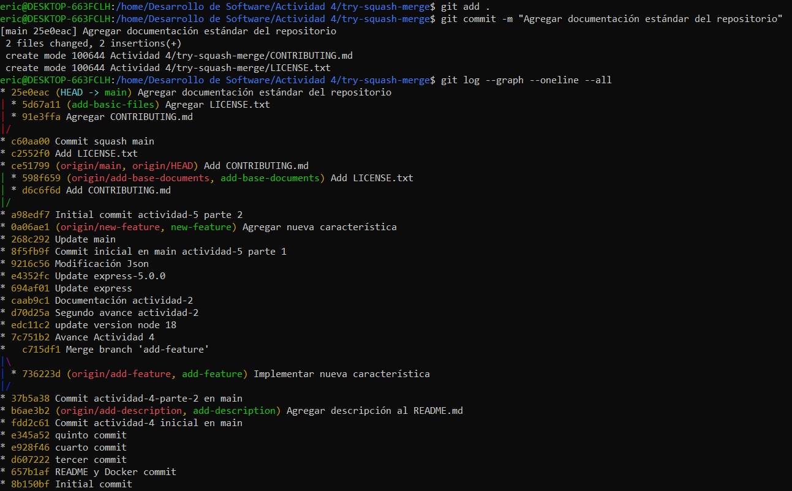
