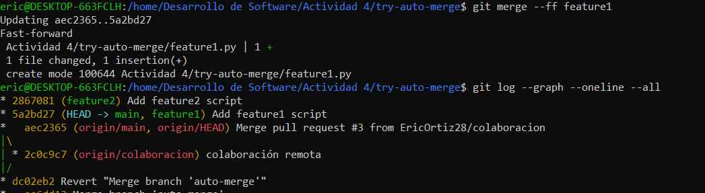

## 1. Fusión Fast-forward (git merge --ff)
>La fusión fast-forward es la forma más simple de combinar ramas en Git. Solo es posible cuando la rama base no ha recibido nuevos commits desde que se creó la rama feature.

**Crear una nueva carpeta**
~~~
mkdir try-fast-forward-merge  # Crea un nuevo directorio llamado 'try-fast-forward-merge'.
cd try-fast-forward-merge     # Cambia el directorio de trabajo al nuevo directorio 'try-fast-forward-merge'.
~~~

**Agregar un archivo inicial en la rama principal (main)**
~~~
echo "# Mi Proyecto" > README.md  # Crea un archivo 'README.md' con el contenido "# Mi Proyecto".
git add README.md                 # Agrega el archivo 'README.md' al área de preparación (stage).
git commit -m "Commit inicial en main"  # Realiza el primer commit en la rama 'main' con el mensaje "Commit inicial en main".
~~~

**Crear y cambiar a una nueva rama 'add-description'**
~~~
git checkout -b add-description   # Crea una nueva rama llamada 'add-description' y cambia a esa rama.

~~~

**Hacer cambios en la nueva rama y comitearlos**
~~~
echo "Este proyecto es un ejemplo de cómo usar Git." >> README.md  # Añade una línea de descripción al archivo 'README.md'.
git add README.md                 # Agrega el archivo modificado 'README.md' al área de preparación (stage).
git commit -m "Agregar descripción al README.md"  # Realiza un commit en la rama 'add-description' con el mensaje "Agregar descripción al README.md".
~~~

**Cambiar de vuelta a la rama 'main' y realizar la fusión fast-forward**
~~~
git checkout main   # Cambia de vuelta a la rama 'main'.
git merge add-description   # Realiza una fusión fast-forward de la rama 'add-description' a la rama 'main'.
~~~

**Ver el historial lineal**
~~~
git log --graph --oneline   # Muestra el historial de commits de manera gráfica y en una línea, para verificar el historial lineal.
~~~

## 2. Fusión No-fast-forward (git merge --no-ff)
>La fusión no-fast-forward crea un nuevo commit de fusión. Es útil para preservar el contexto de la fusión, especialmente en equipos donde se requiere más claridad en el historial de cambios.

**Crear una nueva carpeta**
~~~
mkdir try-no-fast-forward-merge  # Crea un nuevo directorio llamado 'try-no-fast-forward-merge'.
cd try-no-fast-forward-merge     # Cambia el directorio de trabajo al nuevo directorio 'try-no-fast-forward-merge'.
~~~

**Agregar un archivo inicial en la rama principal (main)**
~~~
echo "# Mi Proyecto" > README.md  # Crea un archivo 'README.md' con el contenido "# Mi Proyecto".
git add README.md                 # Agrega el archivo 'README.md' al área de preparación (stage).
git commit -m "Commit inicial en main"  # Realiza el primer commit en la rama 'main' con el mensaje "Commit inicial en main".
~~~

**Crear y cambiar a una nueva rama 'add-feature'**
~~~
git checkout -b add-feature   # Crea una nueva rama llamada 'add-feature' y cambia a esa rama.
~~~

**Hacer cambios en la nueva rama y comitearlos**
~~~
echo "Implementando una nueva característica..." >> README.md  # Añade una línea de descripción al archivo 'README.md'.
git add README.md                 # Agrega el archivo modificado 'README.md' al área de preparación (stage).
git commit -m "Implementar nueva característica"  # Realiza un commit en la rama 'add-feature' con el mensaje "Implementar nueva característica".
~~~

**Cambiar de vuelta a la rama 'main' y realizar una fusión no-fast-forward**
~~~
git checkout main   # Cambia de vuelta a la rama 'main'.
git merge --no-ff add-feature   # Realiza una fusión no-fast-forward de la rama 'add-feature' a la rama 'main'.
~~~

**Después de la edición, veamos el log ahora:**
**Ver el historial**
~~~
git log --graph --oneline   # Muestra el historial de commits de manera gráfica y en una línea, para verificar el historial.
~~~

## 3. Fusión squash (git merge --squash)
>La fusión squash combina todos los cambios de una rama en un solo commit en la rama principal. Este método es útil cuando se quiere mantener un historial de commits limpio.

**Crear una nueva carpeta**
~~~
mkdir try-squash-merge  # Crea un nuevo directorio llamado 'try-squash-merge'.
cd try-squash-merge     # Cambia el directorio de trabajo al nuevo directorio 'try-squash-merge'.
~~~

**Agregar un archivo inicial en la rama principal (main)**
~~~
echo "# Mi Proyecto" > README.md  # Crea un archivo 'README.md' con el contenido "# Mi Proyecto".
git add README.md                 # Agrega el archivo 'README.md' al área de preparación (stage).
git commit -m "Commit inicial en main"  # Realiza el primer commit en la rama 'main' con el mensaje "Commit inicial en main".
~~~

**Crear y cambiar a una nueva rama 'add-basic-files'**
~~~
git checkout -b add-basic-files   # Crea una nueva rama llamada 'add-basic-files' y cambia a esa rama.
~~~

**Hacer algunos cambios y comitearlos**
~~~
echo "# CÓMO CONTRIBUIR" >> CONTRIBUTING.md  # Crea un archivo 'CONTRIBUTING.md' con el contenido "# CÓMO CONTRIBUIR".
git add CONTRIBUTING.md                      # Agrega el archivo 'CONTRIBUTING.md' al área de preparación (stage).
git commit -m "Agregar CONTRIBUTING.md"      # Realiza un commit con el mensaje "Agregar CONTRIBUTING.md".

echo "# LICENCIA" >> LICENSE.txt  # Crea un archivo 'LICENSE.txt' con el contenido "# LICENCIA".
git add LICENSE.txt               # Agrega el archivo 'LICENSE.txt' al área de preparación (stage).
git commit -m "Agregar LICENSE.txt"  # Realiza un commit con el mensaje "Agregar LICENSE.txt".
~~~

**Cambiar de vuelta a la rama 'main' y realizar la fusión squash**
~~~
git checkout main   # Cambia de vuelta a la rama 'main'.
git merge --squash add-basic-files   # Realiza una fusión squash de la rama 'add-basic-files' a la rama 'main'.
~~~

Para completar la fusión squash, realiza un commit:
~~~
git add .   # Agrega todos los archivos al área de preparación (stage).
git commit -m "Agregar documentación estándar del repositorio"  # Realiza un commit consolidado con el mensaje "Agregar documentación estándar del repositorio".
git log --graph --oneline --all   # Muestra el historial de commits de manera gráfica y compacta, incluyendo todas las ramas.
~~~

**Ejercicios**
**Clona un repositorio Git con múltiples ramas.**
- Identifica dos ramas que puedas fusionar utilizando git merge --ff.
- Haz el proceso de fusión utilizando git merge --ff.
- Verifica el historial con git log --graph --oneline.

Pregunta: ¿En qué situaciones recomendarías evitar el uso de git merge --ff? Reflexiona sobre las desventajas de este método.
>Se debe evita git merge --ff cuando se quiere mantener un historial claro y visible de las ramas fusionadas. Al usar --ff se puede ocultar el contexto del trabajo colaborativo y dificultar la trazabilidad de cambios.

**Simula un flujo de trabajo de equipo.**
- Trabaja en dos ramas independientes, creando diferentes cambios en cada una.
- Fusiona ambas ramas con git merge --no-ff para ver cómo se crean los commits de fusión.
- Observa el historial utilizando git log --graph --oneline.

Pregunta: ¿Cuáles son las principales ventajas de utilizar git merge --no-ff en un proyecto en equipo?¿Qué problemas podrían surgir al depender excesivamente de commits de fusión?
>Utilizar git merge --no-ff me ayuda a mantener un historial más claro, ya que puedo ver exactamente cuándo y qué cambios se fusionaron, lo que es útil en proyectos en equipo. Sin embargo, si abuso de los commits de fusión, el historial se puede llenar demasiado y podrían surgir más conflictos.

**Crea múltiples commits en una rama.**
- Haz varios cambios y commits en una rama feature.
- Fusiona la rama con git merge --squash para aplanar todos los commits en uno solo.
- Verifica el historial de commits antes y después de la fusión para ver la diferencia.

Pregunta :¿Cuándo es recomendable utilizar una fusión squash? ¿Qué ventajas ofrece para proyectos grandes en comparación con fusiones estándar?
>Recomendaría usar una fusión con squash cuando se quiere mantener un historial limpio y reducir la cantidad de commits pequeños o experimentales en la rama principal. Esto es especialmente útil en proyectos grandes, ya que agrupar múltiples cambios en un solo commit simplifica el seguimiento del desarrollo y evita que el historial se llene de commits innecesarios o poco significativos.

**Resolver conflictos en una fusión non-fast-forward**
En algunos casos, las fusiones no son tan sencillas y pueden surgir conflictos que necesitas resolver manualmente. Este ejercicio te guiará a través del proceso de manejo de conflictos.

1. Inicializa un nuevo directorio:
~~~
mkdir try-merge-conflict  # Crea un nuevo directorio para el proyecto
cd try-merge-conflict  # Entra en el directorio creado
~~~

2. Crea un archivo index.html y realiza un commit en la rama main:
~~~
echo "<html><body><h1>Proyecto inicial CC3S2</h1></body></html>" > index.html  # Crea un archivo index.html con contenido HTML básico
git add index.html  # Añade el archivo a la zona de preparación (staging area)
git commit -m "commit inicial del index.html en main"  # Realiza un commit inicial en la rama main
~~~

3. Crea y cambia a una nueva rama feature-update:
~~~
git checkout -b feature-update  # Crea y cambia a una nueva rama llamada 'feature-update'
~~~

4. Edita el archivo y realiza un commit en la rama feature-update:
~~~
echo "
Actualización en feature-update
" >> index.html  # Edita el archivo index.html en la rama feature-update
git add index.html  # Añade el archivo modificado a la zona de preparación
git commit -m "Actualiza index.html en feature-update"  # Realiza un commit en la rama feature-update
~~~

5. Regresa a la rama main y realiza una edición en el mismo archivo:
~~~
git checkout main  # Cambia de vuelta a la rama main
echo "<footer>Contacta aquí example@example.com</footer>" >> index.html  # Edita el mismo archivo en la rama main
git add index.html  # Añade el archivo modificado a la zona de preparación
git commit -m "Actualiza index.html en main con contacto"  # Realiza un commit en la rama main
~~~

6. Fusiona la rama feature-update con --no-ff y observa el conflicto:
~~~
git merge --no-ff feature-update  # Intenta fusionar la rama feature-update con main utilizando 'no fast-forward', lo que generará un conflicto
~~~

7. Git detectará un conflicto en index.html. Abre el archivo y resuelve el conflicto. Elimina las líneas de conflicto generadas por Git (<<<<<<<, =======, >>>>>>>) y crea la versión final del archivo con ambos cambios:

8. Agrega el archivo corregido y completa la fusión:
~~~
git add index.html  # Añade el archivo resuelto a la zona de preparación
git commit -m "Resuelve conflicto en index.html entre main y feature-update"  # Completa la fusión resolviendo el conflicto
~~~

9. Verifica el historial para confirmar la fusión y el commit de resolución de conflicto:
~~~
git log --graph --oneline  # Verifica el historial para confirmar la fusión y el commit de resolución de conflicto
~~~

Preguntas:
− ¿Qué pasos adicionales tuviste que tomar para resolver el conflicto?
>Para resolver el conflicto, tuve que revisar el archivo afectado, identificar las diferencias entre ambas ramas y decidir si quería mantener un cambio, el otro, o ambos. Después de elegir, guardé el archivo y lo agregué a la etapa de commit.

− ¿Qué estrategias podrías emplear para evitar conflictos en futuros desarrollos colaborativos?
>Para evitar conflictos en futuros desarrollos colaborativos, sería útil comunicarme más frecuentemente con el equipo, hacer commits más pequeños y frecuentes, y realizar fusiones o rebases regulares para mantener las ramas actualizadas con los últimos cambios.

**Ejercicio: Comparar los historiales con git log después de diferentes fusiones**
Este ejercicio te permitirá observar las diferencias en el historial generado por fusiones fast-forward,non-fast-forward y squash.

Pasos
1. Crea un nuevo directorio y realiza varios commits en dos ramas:
~~~
mkdir try-compare-merge  # Crea un nuevo directorio para el proyecto
cd try-compare-merge  # Entra en el directorio creado
git checkout -b feature-1  # Crea y cambia a una nueva rama 'feature-1'
echo "Caracteristica 1 agregada" >> version.txt  # Agrega una característica en la rama 'feature-1'
git add version.txt  # Añade los cambios a la zona de preparación
git commit -m "Agregar caracteristica 1"  # Realiza un commit en 'feature-1'
git checkout main  # Cambia de vuelta a la rama main
git checkout -b feature-2  # Crea y cambia a una nueva rama 'feature-2'
echo "Caracteristica 2 agregada" >> version.txt  # Agrega una característica en la rama 'feature-2'
git add version.txt  # Añade los cambios a la zona de preparación
git commit -m "Se agrega caracteristica 2"  # Realiza un commit en 'feature-2'
~~~

2. Fusiona feature-1 usando fast-forward:
~~~
git checkout main  # Cambia de vuelta a la rama main
git merge feature-1 --ff  # Fusiona la rama 'feature-1' con main usando fast-forward
~~~

3. Fusiona feature-2 usando non-fast-forward:
~~~
git merge feature-2 --no-ff  # Fusiona la rama 'feature-2' con main usando non-fast-forward
~~~

4. Realiza una nueva rama feature-3 con múltiples commits y fusiónala con squash:
~~~
git checkout -b feature-3  # Crea y cambia a una nueva rama 'feature-3'
echo "Caracteristica 3 paso 1" >> version.txt  # Agrega la primera parte de una nueva característica en la rama 'feature-3'
git add version.txt  # Añade los cambios a la zona de preparación
git commit -m "Caracteristica 3 paso 1"  # Realiza un commit para el primer paso
echo "Caracteristica 3 paso 2" >> version.txt  # Agrega la segunda parte de la característica en 'feature-3'
git add version.txt  # Añade los cambios a la zona de preparación
git commit -m "Caracteristica 3 paso 2"  # Realiza un commit para el segundo paso
git checkout main  # Cambia de vuelta a la rama main
git merge --squash feature-3  # Fusiona los commits de 'feature-3' en uno solo usando squash
git commit -m "Agregar caracteristica 3 en un commit"  # Realiza un commit único que aplana todos los cambios
~~~

5. Compara el historial de Git:
− Historial Fast-forward: git log --graph --oneline --merges --first-parent --branches
− Historial Non-fast-forward: git log --graph --oneline –merges
− Historial con Squash: git log --graph --oneline --merges --decorate --all
~~~
git log --graph --oneline  # Verifica el historial para comparar las diferentes fusiones
~~~

 Preguntas:
− ¿Cómo se ve el historial en cada tipo de fusión?
>El historial Fast-forward es limpio y lineal, ideal para proyectos pequeños. El Non-fast-forward es más ramificado y muestra claramente las fusiones, lo cual es útil en proyectos grandes. El historial con Squash simplifica todo al mostrar las fusiones como un solo commit, manteniendo un registro ordenado.

− ¿Qué método prefieres en diferentes escenarios y por qué?
>Prefiero el Fast-forward en proyectos pequeños por su claridad, el Non-fast-forward en proyectos grandes para seguir las fusiones, y el Squash para mantener un historial limpio al integrar características pequeñas.

**Ejercicio: Usando fusiones automáticas y revertir fusiones**

En este ejercicio, aprenderás cómo Git puede fusionar automáticamente cambios cuando no hay conflictos y cómo revertir una fusión si cometes un error.

Pasos
1. Inicializa un nuevo directorio y realiza dos commits en main:
~~~
mkdir try-auto-merge  # Crea un nuevo directorio para el proyecto
cd try-auto-merge  # Entra en el directorio creado
echo "Linea 1" > file.txt  # Crea un archivo llamado file.txt con la primera línea
git add file.txt  # Añade el archivo a la zona de preparación
git commit -m "Agrega linea 1"  # Realiza un commit con el primer cambio

echo "Linea 2" >> file.txt  # Añade una segunda línea al archivo file.txt
git add file.txt  # Añade el archivo modificado a la zona de preparación
git commit -m "...linea 2"  # Realiza un commit con el segundo cambio
~~~

2. Crea una nueva rama auto-merge y realiza otro commit en file.txt:
~~~
git checkout -b auto-merge  # Crea y cambia a una nueva rama llamada 'auto-merge'
echo "Linea 3" >> file.txt  # Añade una tercera línea en la rama 'auto-merge'
git add file.txt  # Añade el archivo modificado a la zona de preparación
git commit -m "...linea 3"  # Realiza un commit con el tercer cambio en 'auto-merge'
~~~

3. Vuelve a main y realiza cambios no conflictivos en otra parte del archivo:
~~~
git checkout main  # Cambia de vuelta a la rama main
echo "Footer: Fin del archivo" >> footer.txt  # Añade una línea al final del archivo en la rama main
git add footer.txt  # Añade el archivo modificado a la zona de preparación
git commit -m "Add footer in new file.txt"  # Realiza un commit con la nueva línea en la rama main
~~~

4. Fusiona la rama auto-merge con main:
~~~
git merge auto-merge  # Fusiona la rama 'auto-merge' con la rama main, Git fusionará automáticamente sin conflictos
~~~

5. Git debería fusionar los cambios automáticamente sin conflictos.
6. Revertir la fusión: Si decides que la fusión fue un error, puedes revertirla:
~~~
git revert -m 1 HEAD  # Si la fusión fue un error, usa este comando para revertirla
~~~

7. Verifica el historial:
~~~
git log --graph --oneline  # Verifica nuevamente el historial para ver el revert de la fusión
~~~

Preguntas:
− ¿Cuándo usarías un comando como git revert para deshacer una fusión?
>Usaría git revert para deshacer una fusión cuando la fusión ya fue completada y resulta que los cambios no eran correctos, pero quiero mantener el historial intacto sin eliminar commits.

− ¿Qué tan útil es la función de fusión automática en Git?
>La fusión automática en Git es muy útil para manejar cambios sin intervención manual, pero cuando hay conflictos, sigue siendo importante revisarlos manualmente para asegurarse de que el código final sea correcto.

Ejercicio: Fusión remota en un repositorio colaborativo
Este ejercicio te permitirá practicar la fusión de ramas en un entorno remoto colaborativo, simulando un
flujo de trabajo de equipo.
Pasos:
1. Clona un repositorio remoto desde GitHub o crea uno nuevo:
~~~
git clone https://github.com/tu-usuario/nombre-del-repositorio.git  # Clona un repositorio remoto de GitHub
cd nombre-del-repositorio  # Entra en el directorio del repositorio clonado
~~~
2. Crea una nueva rama colaboracion y haz algunos cambios:
~~~
git checkout -b colaboracion  # Crea y cambia a una nueva rama llamada 'colaboracion'
echo "Colaboración remota" > colaboracion.txt  # Crea un archivo llamado colaboracion.txt
git add colaboracion.txt  # Añade el archivo a la zona de preparación
git commit -m "Añadir colaboración remota"  # Realiza un commit con la colaboración remota
~~~

3. Empuja los cambios a la rama remota:
~~~
git push origin colaboracion  # Empuja los cambios al repositorio remoto en la rama 'colaboracion'
~~~

4. Simula una fusión desde la rama colaboracion en la rama main de otro colaborador. (Puedes usar la interfaz de GitHub para crear un Pull Request y realizar la fusión).

Preguntas:
− ¿Cómo cambia la estrategia de fusión cuando colaboras con otras personas en un repositorio remoto?
> Cuando colaboro en un repositorio remoto, uso fusiones más cuidadosas para evitar conflictos y asegurar que los cambios de otros no se sobrescriban.

− ¿Qué problemas comunes pueden surgir al integrar ramas remotas?
>Los problemas comunes al integrar ramas remotas incluyen conflictos de código y diferencias en las versiones de archivos.

Ejercicio final: flujo de trabajo completo
1. Configura un proyecto simulado:
o Crea un proyecto con tres ramas: main, feature1, y feature2.
o Realiza varios cambios en feature1 y feature2 y simula colaboraciones paralelas.
~~~
git checkout -b feature1  # Crea y cambia a la rama 'feature1'
echo "print('Feature 1')" > feature1.py  # Crea un archivo de Python con contenido en la rama 'feature1'
git add feature1.py  # Añade el archivo a la zona de preparación
git commit -m "Add feature1 script"  # Realiza un commit de los cambios en la rama 'feature1'

git checkout -b feature2  # Crea y cambia a la rama 'feature2'
echo "print('Feature 2')" > feature2.py  # Crea un archivo de Python con contenido en la rama 'feature2'
git add feature2.py  # Añade el archivo a la zona de preparación
git commit -m "Add feature2 script"  # Realiza un commit de los cambios en la rama 'feature2'
git checkout main  # Cambia a la rama principal 'main'
git log --graph --oneline --all  # Verifica el historial antes de fusionar
~~~

2. Realiza fusiones utilizando diferentes métodos:
o Fusiona feature1 con main utilizando git merge --ff.
o Fusiona feature2 con main utilizando git merge --no-ff.
o Haz una rama adicional llamada feature3 y aplasta sus commits utilizando git merge --squash.
~~~
git merge --ff feature1  # Fusiona la rama 'feature1' con la rama 'main' usando fast-forward
git log --graph --oneline --all  # Verifica el historial después de la fusión con fast-forward

git merge --no-ff feature2  # Fusiona la rama 'feature2' con la rama 'main' usando non-fast-forward
git log --graph --oneline --all  # Verifica el historial después de la fusión con non-fast-forward

git checkout -b feature3  # Crea y cambia a la rama 'feature3'
echo "print('Feature 3')" > feature3.py  # Crea un archivo de Python con contenido en la rama 'feature3'
git add feature3.py  # Añade el archivo a la zona de preparación
git commit -m "Add feature3 script"  # Realiza un commit en la rama 'feature3'

echo "print('Feature 3 - Second change')" >> feature3.py  # Añade más cambios al archivo en 'feature3'
git add feature3.py  # Añade los cambios a la zona de preparación
git commit -m "Update feature3 script with second change"  # Realiza otro commit en feature3

git checkout main  # Cambia de nuevo a la rama principal 'main'
git merge --squash feature3  # Aplana los commits de 'feature3' en un solo commit
git commit -m "Squashed feature3 into one commit"  # Realiza un solo commit con todos los cambios de feature3

git log --graph --oneline --all  # Verifica el historial después de la fusión con squash
~~~

3. Analiza el historial de commits:
o Revisa el historial para entender cómo los diferentes métodos de fusión afectan el árbol de commits.

