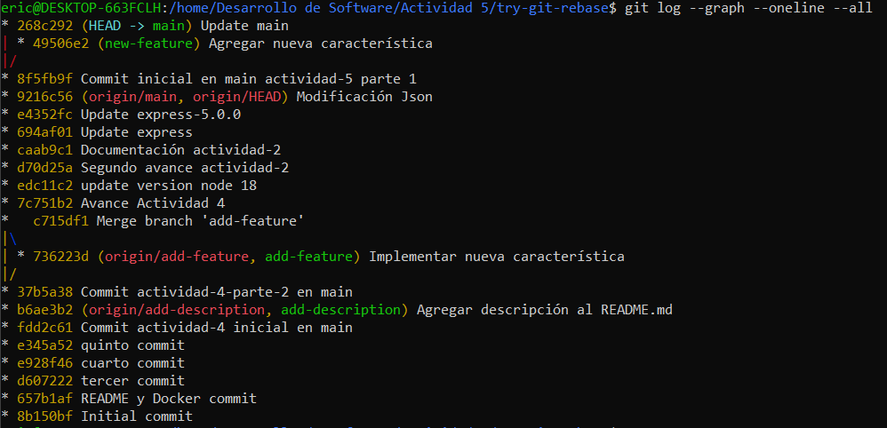
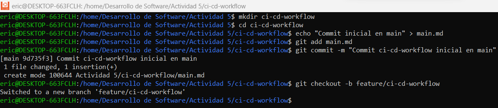
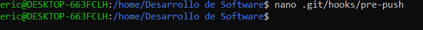

## git rebase para mantener un historial lineal

**Escenario de ejemplo:**
- Crea un nuevo repositorio Git y dos ramas, main y new-feature:
~~~
mkdir try-git-rebase   # Crea un nuevo directorio llamado 'try-git-rebase'
cd try-git-rebase      # Cambia al directorio 'try-git-rebase'
git init               # Inicializa un nuevo repositorio Git en el directorio actual
echo "# Mi Proyecto de Rebase" > README.md   # Crea un archivo README.md con el texto "# Mi Proyecto de Rebase"
git add README.md      # Añade el archivo README.md al área de staging
git commit -m "Commit inicial en main"   # Realiza un commit con el mensaje "Commit inicial en main"
~~~

- Crea y cambia a la rama new-feature:
~~~
git checkout -b new-feature   # Crea y cambia a una nueva rama llamada 'new-feature'
echo "Esta es una nueva característica." > NewFeature.md   # Crea un archivo NewFeature.md con el texto "Esta es una nueva característica."
git add NewFeature.md         # Añade el archivo NewFeature.md al área de staging
git commit -m "Agregar nueva característica"   # Realiza un commit con el mensaje "Agregar nueva característica"
~~~

-Cambiar de nuevo a 'main' y agregar nuevos commits
~~~
git checkout main   # Cambia de vuelta a la rama 'main'
echo "Updates to the project." >> Updates.md   # Añade la línea "Updates to the project." al archivo Updates.md (o lo crea si no existe)
git add Updates.md   # Añade el archivo Updates.md al área de staging
git commit -m "Update main"   # Realiza un commit con el mensaje "Update main"
~~~

> Tarea: Realiza el rebase de new-feature sobre main con los siguientes comandos:
~~~
git checkout new-feature   # Cambia a la rama 'new-feature'
git rebase main   # Realiza el rebase de la rama 'new-feature' sobre la rama 'main'
~~~

**3. Revisión:**
Después de realizar el rebase, visualiza el historial de commits con:
~~~
git log --graph --oneline   # Muestra el historial de commits en forma gráfica y compacta, después del rebase
~~~

**4. Momento de fusionar y completar el proceso de git rebase:**
Cambiar a 'main' y realizar una fusión fast-forward
~~~
git checkout main   # Cambia a la rama 'main'
git merge new-feature   # Realiza una fusión fast-forward de la rama 'new-feature' en 'main', completando el proceso de rebase
~~~

## git cherry-pick para la integración selectiva de commit

ejemplo:
**Inicializar un nuevo repositorio**
~~~
mkdir try-cherry-pick   # Crea un nuevo directorio llamado 'try-cherry-pick'
cd try-cherry-pick      # Cambia al directorio 'try-cherry-pick'
git init                # Inicializa un nuevo repositorio Git en el directorio actual
~~~

**Agregar y commitear README.md inicial a main**
~~~
echo "# My Project" > README.md   # Crea un archivo README.md con el texto "# My Project"
git add README.md                 # Añade el archivo README.md al área de staging
git commit -m "Initial commit"    # Realiza un commit con el mensaje "Initial commit"
~~~

**Crear y cambiar a una nueva rama 'add-base-documents'**
~~~
git checkout -b add-base-documents   # Crea y cambia a una nueva rama llamada 'add-base-documents'
~~~

**Hacer cambios y commitearlos**
**Agregar CONTRIBUTING.md**
~~~
echo "# CONTRIBUTING" >> CONTRIBUTING.md   # Crea el archivo CONTRIBUTING.md con el texto "# CONTRIBUTING"
git add CONTRIBUTING.md                    # Añade CONTRIBUTING.md al área de staging
git commit -m "Add CONTRIBUTING.md"        # Realiza un commit con el mensaje "Add CONTRIBUTING.md"
~~~

**Agregar LICENSE.txt**
~~~
echo "LICENSE" >> LICENSE.txt   # Crea el archivo LICENSE.txt con el texto "LICENSE"
git add LICENSE.txt             # Añade LICENSE.txt al área de staging
git commit -m "Add LICENSE.txt" # Realiza un commit con el mensaje "Add LICENSE.txt"
~~~

**Echa un vistazo al log de la rama 'add-base-documents'**
~~~
git log add-base-documents --graph --oneline   # Muestra el historial de commits de la rama 'add-base-documents' en formato gráfico y compacto
~~~

>Tarea: Haz cherry-pick de un commit de add-base-documents a main:
~~~
git checkout main                     # Cambia a la rama 'main'
git cherry-pick a80e8ad               # Aplica el commit específico con el hash 'a80e8ad' de la rama 'add-base-documents' en 'main'
~~~

**Revisión: Revisa el historial nuevamente:**
~~~
git log --graph --oneline   # Muestra el historial de commits de manera gráfica y compacta para verificar que el cherry-pick fue exitoso
~~~

**Preguntas de discusión:**
**1.** ¿Por qué se considera que rebase es más útil para mantener un historial de proyecto lineal en comparación con merge?
>Rebase es considerado más útil para mantener un historial lineal porque reorganiza los commits de una rama sobre la otra, eliminando la necesidad de un commit de "merge" que fusiona ramas. Al aplicar rebase, los commits se aplican como si hubieran sido desarrollados directamente sobre la rama principal.

**2.** ¿Qué problemas potenciales podrían surgir si haces rebase en una rama compartida con otros miembros del equipo?
>Puede crear conflictos para otros colaboradores que ya han basado su trabajo en los commits originales.
>
>**Conflictos al hacer pull/push:** Otros miembros del equipo tendrían que forzar la actualización de su rama local con los nuevos commits, lo que podría causar pérdida de trabajo.
>
>**Historial inconsistente:** Las referencias a los commits anteriores se pierden, lo que puede generar confusión o errores cuando los demás tratan de resolver conflictos.

**3.** ¿En qué se diferencia cherry-pick de merge, y en qué situaciones preferirías uno sobre el otro?
>Cherry-pick aplica un commit específico de una rama a otra sin necesidad de fusionar todo el historial de la rama de origen, mientras que merge une dos ramas completas, incluyendo todos los cambios y el historial asociado.

**4.** ¿Por qué es importante evitar hacer rebase en ramas públicas?
>Es importante evitar hacer rebase en ramas públicas porque el rebase reescribe el historial, creando una nueva secuencia de commits. Si otros desarrolladores ya han basado su trabajo en la versión anterior de la rama, estos cambios en el historial causarán conflictos cuando intenten actualizar su código. 

**Ejercicios teóricos**
**1.** Diferencias entre git merge y git rebase

Pregunta: Explica la diferencia entre git merge y git rebase y describe en qué escenarios sería más adecuado utilizar cada uno en un equipo de desarrollo ágil que sigue las prácticas de Scrum.
>Git merge crea un commit de fusión que une dos ramas completas, preservando su historial, mientras que git rebase reorganiza los commits de una rama sobre otra para mantener un historial lineal. En un equipo Scrum, merge es útil para rastrear integraciones y decisiones de desarrollo, mientras que rebase es ideal para mantener un historial claro y ordenado en la integración continua de pequeñas funcionalidades.

**2.** Relación entre git rebase y DevOps

Pregunta: ¿Cómo crees que el uso de git rebase ayuda a mejorar las prácticas de DevOps, especialmente en la implementación continua (CI/CD)? Discute los beneficios de mantener un historial lineal en el contexto de una entrega continua de código y la automatización de pipelines.
>Mantener un historial lineal con rebase facilita la comprensión del código y simplifica las revisiones y la depuración, al evitar bifurcaciones innecesarias. Además, reduce conflictos en la automatización CI/CD, permitiendo una mejor gestión de integraciones. Al evitar los merge commits, se agiliza la entrega continua de nuevas funcionalidades y se simplifica el proceso.

**3.** Impacto del git cherry-pick en un equipo Scrum

Pregunta: Un equipo Scrum ha finalizado un sprint, pero durante la integración final a la rama principal (main) descubren que solo algunos commits específicos de la rama de una funcionalidad deben aplicarse a producción. ¿Cómo podría ayudar git cherry-pick en este caso? Explica los beneficios y posibles complicaciones.
>Git cherry-pick permite aplicar solo ciertos commits de una rama funcional a producción, ideal para entregar funcionalidades listas y aprobadas sin fusionar todo el código. Esto minimiza riesgos al evitar cambios incompletos. Sin embargo, puede generar conflictos si los commits seleccionados dependen de otros cambios, y su uso frecuente puede desincronizar las ramas, complicando el mantenimiento.

**Ejercicios prácticos**
**1.** Simulación de un flujo de trabajo Scrum con git rebase y git merge
Contexto:
**•** Tienes una rama main y una rama feature en la que trabajas. Durante el desarrollo del sprint, se han realizado commits tanto en main como en feature.
**•** Tu objetivo es integrar los cambios de la rama feature en main manteniendo un historial limpio.

**Instrucciones:**

1. Crea un directorio y haz algunos commits en la rama main.
~~~
mkdir scrum-workflow   # Crea un directorio llamado 'scrum-workflow'
cd scrum-workflow      # Cambia al directorio 'scrum-workflow'

echo "Commit inicial en main" > mainfile.md  # Crea un archivo con contenido inicial en la rama 'main'
git add mainfile.md                          # Agrega el archivo a staging
git commit -m "Commit inicial en main"       # Crea el primer commit en 'main'
~~~

2. Crea una rama feature, agrega nuevos commits, y luego realiza algunos commits adicionales en main.
~~~
git checkout -b feature                      # Crea y cambia a la rama 'feature'
echo "Nueva característica en feature" > featurefile.md  # Agrega un nuevo archivo en 'feature'
git add featurefile.md                                   # Agrega el archivo a staging
git commit -m "Commit en feature"                        # Realiza un commit en 'feature'

git checkout main                            # Cambia de vuelta a la rama 'main'
echo "Actualización en main" >> mainfile.md  # Actualiza el archivo en la rama 'main'
git add mainfile.md                          # Agrega el archivo actualizado a staging
git commit -m "Actualización en main"        # Realiza un commit en 'main'
~~~

3. Realiza un rebase de feature sobre main.
~~~
git checkout feature                         # Cambia de vuelta a la rama 'feature'
git rebase main                              # Hace rebase de 'feature' sobre 'main'
~~~

4. Finalmente, realiza una fusión fast-forward de feature con main.
~~~
git checkout main                            # Cambia de vuelta a la rama 'main'
git merge feature --ff-only                  # Realiza una fusión fast-forward de 'feature' a 'main'
~~~

**Preguntas:**
**•** ¿Qué sucede con el historial de commits después del rebase?
>Después de realizar el rebase, el historial de commits de la rama feature/scrum-workflow se "reaplica" sobre la punta de la rama main. Esto significa que los commits de feature/scrum-workflow se colocan como si se hubieran realizado directamente después de los commits en main, eliminando cualquier bifurcación. Como resultado, el historial se mantiene lineal y limpio, sin los "merge commits" que normalmente aparecen al fusionar dos ramas.

**•** ¿En qué situación aplicarías una fusión fast-forward en un proyecto ágil?
>En un proyecto ágil, esta técnica es útil cuando se trabaja en pequeñas funcionalidades o correcciones que pueden integrarse rápidamente a la rama principal sin crear bifurcaciones en el historial.

**2.** Cherry-pick para integración selectiva en un pipeline CI/CD Contexto:

**•** Durante el desarrollo de una funcionalidad, te das cuenta de que solo ciertos cambios deben ser integrados en la rama de producción, ya que el resto aún está en desarrollo. Para evitar fusionar toda la rama, decides hacer cherry-pick de los commits que ya están listos para producción.

**Instrucciones:**

1. Crea un repositorio con una rama main y una rama feature.
~~~
mkdir ci-cd-workflow   # Crea un directorio llamado 'ci-cd-workflow'
cd ci-cd-workflow      # Cambia al directorio 'ci-cd-workflow'
echo "Commit inicial en main" > main.md  # Crea un archivo con contenido inicial en la rama 'main'
git add main.md                          # Agrega el archivo a staging
git commit -m "Commit inicial en main"   # Crea el primer commit en 'main'
git checkout -b feature                  # Crea y cambia a la rama 'feature'
~~~

2. Haz varios commits en la rama feature, pero solo selecciona uno o dos commits específicos que consideres listos para producción.
~~~
echo "Primera característica" > feature1.md  # Crea un archivo con la primera característica
git add feature1.md                          # Agrega el archivo a staging
git commit -m "Agregar primera característica"  # Realiza un commit en 'feature'

echo "Segunda característica" > feature2.md  # Crea un archivo con la segunda característica
git add feature2.md                          # Agrega el archivo a staging
git commit -m "Agregar segunda característica"  # Realiza un commit en 'feature'
~~~

3. Realiza un cherry-pick de esos commits desde feature a main.
~~~
git checkout main                         # Cambia de vuelta a la rama 'main'
git cherry-pick <hash_del_commit1>        # Cherry-pick del primer commit de la rama 'feature' a 'main'
~~~

4. Verifica que los commits cherry-picked aparezcan en main.

**Preguntas:**

**•** ¿Cómo utilizarías cherry-pick en un pipeline de CI/CD para mover solo ciertos cambios listos a producción?

>En un pipeline de CI/CD, usaría cherry-pick cuando ciertos commits en una rama de desarrollo están listos para ser desplegados en producción, pero otros aún no. Por ejemplo, si estoy desarrollando varias características en una rama feature y solo una o dos están listas, puedo hacer cherry-pick de esos commits específicos y moverlos a la rama main (o producción), sin fusionar todo el trabajo en progreso. 

**•** ¿Qué ventajas ofrece cherry-pick en un flujo de trabajo de DevOps?
>cherry-pick es una herramienta poderosa en DevOps porque otorga más granularidad y control sobre qué partes del código se liberan en producción sin depender de la fusión completa de una rama.

**Git, Scrum y Sprints**

**Fase 1: Planificación del sprint (sprint planning)**

**Ejercicio 1: Crear ramas de funcionalidades (feature branches)**

En esta fase del sprint, los equipos Scrum deciden qué historias de usuario van a trabajar. Cada historia de usuario puede representarse como una rama de funcionalidad.

**Objetivo:** Crear ramas para cada historia de usuario y asegurar que el trabajo se mantenga aislado.

**Instrucciones:**

1. Crea un directorio.
~~~
mkdir scrum-project   # Crea un directorio llamado 'scrum-project'
cd scrum-project      # Cambia al directorio 'scrum-project'
~~~

2. Crea un commit en la rama main donde estará el código base.
~~~
echo "# Proyecto Scrum" > README.md  # Crea un archivo README
git add README.md                    # Agrega el archivo a staging
git commit -m "Commit inicial en main"  # Realiza el commit inicial en la rama 'main'
~~~

3. Crea una rama por cada historia de usuario asignada al sprint, partiendo de la rama main.
~~~
git checkout -b feature-user-story-1  # Crea y cambia a la rama para la historia de usuario 1
git checkout -b feature-user-story-2  # Crea y cambia a la rama para la historia de usuario 2
~~~

**Pregunta:** ¿Por qué es importante trabajar en ramas de funcionalidades separadas durante un sprint?

>Trabajar en ramas de funcionalidades separadas durante un sprint es crucial porque permite aislar el desarrollo de cada historia de usuario, lo que facilita la gestión de cambios sin interferir con el trabajo de otros miembros del equipo.

**Fase 2: Desarrollo del sprint (sprint execution)**

**Ejercicio 2: Integración continua con git rebase**

A medida que los desarrolladores trabajan en sus respectivas historias de usuario, pueden ocurrir cambios en main. Para mantener un historial lineal y evitar conflictos más adelante, se usa git rebase para integrar los últimos cambios de main en las ramas de funcionalidad antes de finalizar el
sprint.

**Objetivo:** Mantener el código de la rama de funcionalidad actualizado con los últimos cambios de main durante el sprint.
**Instrucciones:**

**1.** Haz algunos commits en main.
~~~
git checkout main                          # Cambia a la rama 'main'
echo "Actualización en main" > updates.md  # Agrega un archivo con actualizaciones en 'main'
git add updates.md                         # Agrega el archivo a staging
git commit -m "Actualizar main con nuevas funcionalidades"  # Realiza un commit en 'main'
~~~

**2.** Realiza un rebase de la rama feature-user-story-1 para actualizar su base con los últimos cambios de main.
~~~
git checkout feature-user-story-1          # Cambia a la rama 'feature-user-story-1'
git rebase main                            # Realiza un rebase de 'main' sobre 'feature-user-story-1'
~~~

**Pregunta:** ¿Qué ventajas proporciona el rebase durante el desarrollo de un sprint en términos de integración continua?

>El rebase durante el desarrollo de un sprint proporciona varias ventajas en términos de integración continua, como mantener un historial lineal, lo que facilita la revisión y depuración del código. Además, permite que las ramas de funcionalidad estén siempre actualizadas con los últimos cambios de main, lo que minimiza los conflictos al momento de integrar las historias de usuario al final del sprint. 

**Fase 3: Revisión del sprint (sprint review)**

**Ejercicio 3: Integración selectiva con git cherry-pick**

En esta fase, es posible que algunas funcionalidades estén listas para ser mostradas a los stakeholders,pero otras aún no están completamente implementadas. Usar git cherry-pick puede permitirte seleccionar commits específicos para mostrar las funcionalidades listas, sin hacer merge de ramas incompletas.

**Objetivo:** Mover commits seleccionados de una rama de funcionalidad (feature-user-story-2) a main sin integrar todos los cambios.

**Instrucciones:**
1. Realiza algunos commits en feature-user-story-2.
~~~
git checkout feature-user-story-2          # Cambia a la rama 'feature-user-story-2'
echo "Funcionalidad lista" > feature2.md   # Agrega un archivo con funcionalidad lista
git add feature2.md                        # Agrega el archivo a staging
git commit -m "Funcionalidad lista para revisión"  # Realiza un commit

echo "Funcionalidad en progreso" > progress.md  # Agrega un archivo con funcionalidad en progreso
git add progress.md                             # Agrega el archivo a staging
git commit -m "Funcionalidad aún en progreso"   # Realiza un commit
~~~

2. Haz cherry-pick de los commits que estén listos para mostrarse a los stakeholders durante la revisión del sprint.
~~~
git checkout main                               # Cambia a la rama 'main'
git cherry-pick <hash_del_commit_de_feature-lista>  # Cherry-pick del commit listo para revisión
~~~

**Pregunta:** ¿Cómo ayuda git cherry-pick a mostrar avances de forma selectiva en un sprint review?
>Git cherry-pick permite mostrar avances de forma selectiva en un sprint review al trasladar únicamente los commits de funcionalidades completas y listas para ser presentadas, sin tener que fusionar toda la rama de desarrollo, que podría incluir trabajo incompleto.

**Fase 4: Retrospectiva del sprint (sprint retrospective)**
**Ejercicio 4: Revisión de conflictos y resolución**

Durante un sprint, pueden surgir conflictos al intentar integrar diferentes ramas de funcionalidades. Es importante aprender cómo resolver estos conflictos y discutirlos en la retrospectiva.

**Objetivo:** Identificar y resolver conflictos de fusión con git merge al intentar integrar varias ramas de funcionalidades al final del sprint.

**Instrucciones:**

1. Realiza cambios en feature-user-story-1 y feature-user-story-2 que resulten en conflictos.
~~~
git checkout feature-user-story-1                 # Cambia a la rama 'feature-user-story-1'
echo "Cambio en la misma línea" > conflicted-file.md  # Modifica el archivo en 'feature-user-story-1'
git add conflicted-file.md                        # Agrega el archivo a staging
git commit -m "Cambio en feature 1"               # Realiza un commit en 'feature-user-story-1'

git checkout feature-user-story-2                 # Cambia a la rama 'feature-user-story-2'
echo "Cambio diferente en la misma línea" > conflicted-file.md  # Modifica el archivo en 'feature-user-story-2'
git add conflicted-file.md                        # Agrega el archivo a staging
git commit -m "Cambio en feature 2"               # Realiza un commit en 'feature-user-story-2'
~~~

2. Intenta hacer merge de ambas ramas con main y resuelve los conflictos.
~~~
git checkout main                                 # Cambia a la rama 'main'
git merge feature-user-story-1                    # Realiza un merge de la rama 'feature-user-story-1' a 'main'
git merge feature-user-story-2                    # Intenta realizar el merge de 'feature-user-story-2' a 'main' (resolver conflictos)
~~~

**Pregunta :** ¿Cómo manejas los conflictos de fusión al final de un sprint? ¿Cómo puede el equipo mejorar la comunicación para evitar conflictos grandes?

>Para manejar los conflictos de fusión al final de un sprint, es importante identificar los conflictos usando git status, resolverlos manualmente abriendo los archivos afectados y eligiendo cómo combinar los cambios, y luego realizar pruebas para asegurar que el código funcione correctamente tras la resolución. Para evitar conflictos grandes, el equipo debe sincronizarse frecuentemente mediante merges o rebases, mantener una comunicación clara sobre las áreas del código en las que están trabajando, y definir responsabilidades claras para evitar que varios desarrolladores modifiquen las mismas líneas de código sin coordinación. 

**Fase de desarrollo: automatización de integración continua (CI) con git rebase**
**Ejercicio 5: Automatización de rebase con hooks de Git**

En un entorno CI, es común automatizar ciertas operaciones de Git para asegurar que el código se mantenga limpio antes de que pase a la siguiente fase del pipeline. Usa los hooks de Git para automatizar el rebase cada vez que se haga un push a una rama de funcionalidad.

**Objetivo:** Implementar un hook que haga automáticamente un rebase de main antes de hacer push en una rama de funcionalidad, asegurando que el historial se mantenga limpio.

**Instrucciones:**

1. Configura un hook pre-push que haga un rebase automático de la rama main sobre la rama de funcionalidad antes de que el push sea exitoso.
~~~
nano .git/hooks/pre-push   # Crea un archivo hook pre-push para automatizar el rebase

# Dentro del archivo, añade este script:
#!/bin/bash
git fetch origin main
git rebase origin/main

chmod +x .git/hooks/pre-push  # Haz el archivo ejecutable
~~~

2. Prueba el hook haciendo push de algunos cambios en la rama feature-user-story-1.
~~~
git checkout feature-user-story-1  # Cambia a la rama 'feature-user-story-1'
echo "Cambios importantes" > feature1.md  # Agrega un archivo con cambios importantes
git add feature1.md                       # Agrega el archivo a staging
git commit -m "Cambios importantes en feature 1"  # Realiza un commit

git push origin feature-user-story-1  # Realiza el push, ejecutando el rebase automáticamente
~~~

**Pregunta:** Qué ventajas y desventajas observas al automatizar el rebase en un entorno de CI/CD?.

>Automatizar el rebase en CI/CD ayuda a mantener un historial limpio y lineal, reduciendo conflictos y asegurando que las ramas estén siempre actualizadas con main. Sin embargo, puede generar interrupciones si hay conflictos que requieren intervención manual, y en equipos grandes, los rebase automáticos pueden provocar más conflictos y la necesidad de hacer force push.

