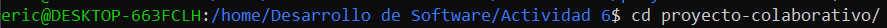
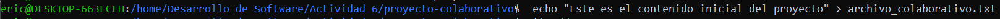
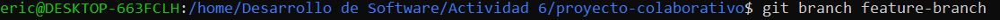
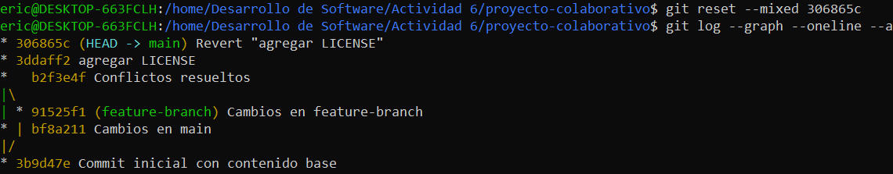

**1. Inicialización del proyecto y creación de ramas**
- Paso 1: Crea un nuevo proyecto en tu máquina local.
~~~
mkdir proyecto-colaborativo   # Crea un nuevo directorio llamado 'proyecto-colaborativo'
cd proyecto-colaborativo      # Cambia al directorio 'proyecto-colaborativo'
~~~

- Paso 2: Inicializa Git en tu proyecto.
~~~
git init   # Inicializa un nuevo repositorio Git en el directorio actual
~~~
- Paso 3: Crea un archivo de texto llamado archivo_colaborativo.txt y agrega algún contenido inicial.
~~~
echo "Este es el contenido inicial del proyecto" > archivo_colaborativo.txt   # Crea un archivo de texto con contenido inicial
~~~

- Paso 4: Agrega el archivo al área de staging y haz el primer commit.
~~~
git add .   # Añade todos los archivos (incluyendo 'archivo_colaborativo.txt') al área de staging
git commit -m "Commit inicial con contenido base"   # Realiza un commit con el mensaje "Commit inicial con contenido base"
~~~

- Paso 5: Crea dos ramas activas: main y feature-branch.
~~~
git branch feature-branch   # Crea una nueva rama llamada 'feature-branch'
~~~

- Paso 6: Haz checkout a la rama feature-branch y realiza un cambio en el archivo 
~~~
git checkout feature-branch   # Cambia a la rama 'feature-branch'
echo "Este es un cambio en la feature-branch" >> archivo_colaborativo.txt   # Añade una nueva línea al archivo en la rama 'feature-branch'
git add .   # Añade los cambios al área de staging
git commit -m "Cambios en feature-branch"   # Realiza un commit con el mensaje "Cambios en feature-branch"
~~~

- Paso 7: Regresa a la rama main y realiza otro cambio en la misma línea del archivo
~~~
git checkout main   # Cambia de nuevo a la rama 'main'
echo "Este es un cambio en la rama main" >> archivo_colaborativo.txt   # Añade una nueva línea al archivo en la rama 'main'
git add .   # Añade los cambios al área de staging
git commit -m "Cambios en main"   # Realiza un commit con el mensaje "Cambios en main"
~~~

**2. Fusión y resolución de conflictos**
- Paso 1: Intenta fusionar feature-branch en main. Se espera que surjan conflictos de fusión.
~~~
git merge feature-branch   # Intenta fusionar la rama 'feature-branch' en 'main'. Es probable que surjan conflictos en 'archivo_colaborativo.txt'
~~~

- Paso 2: Usa git status para identificar los archivos en conflicto. Examina los archivos afectados y resuelve manualmente los conflictos, conservando las líneas de código más relevantes para el proyecto.
~~~
git status   # Muestra los archivos en conflicto (marcados como 'unmerged')
git checkout --theirs archivo_colaborativo.txt   # Acepta los cambios de la rama 'feature-branch'
git checkout --ours archivo_colaborativo.txt   # Acepta los cambios de la rama 'main'
~~~

- Paso 3: Una vez resueltos los conflictos, commitea los archivos y termina la fusión
~~~
git add .   # Añade los archivos con conflictos resueltos al área de staging
git commit -m "Conflictos resueltos"   # Realiza un commit indicando que los conflictos han sido resueltos
~~~

**3. Simulación de fusiones y uso de git diff**
- Paso 1: Simula una fusión usando git merge --no-commit --no-ff para ver cómo se comportarían los cambios antes de realizar el commit.

~~~
git merge --no-commit --no-ff feature-branch   # Simula la fusión de 'feature-branch' en la rama actual sin hacer commit automáticamente ni usar fast-forward
git diff --cached   # Muestra los cambios que se han preparado en el área de staging después de la fusión simulada
git merge --abort   # Aborta la fusión y regresa el repositorio al estado anterior, deshaciendo cualquier cambio introducido por la fusión
~~~

**4. Uso de git mergetool**
- Paso 1: Configura git mergetool con una herramienta de fusión visual (puedes usar meld, vimdiff, o
Visual Studio Code).

~~~
git config --global merge.tool vscode  # Configura Visual Studio Code como herramienta de fusión por defecto
git mergetool  # Inicia la herramienta de fusión configurada para resolver conflictos
~~~

- Paso 2: Usa la herramienta gráfica para resolver un conflicto de fusión.

**5. Uso de git revert y git reset**
- Paso 1: Simula la necesidad de revertir un commit en main debido a un error. Usa git revert para crear un commit que deshaga los cambios.
~~~
git revert <commit_hash>  # Crea un nuevo commit que revierte los cambios del commit especificado
~~~

- Paso 2: Realiza una prueba con git reset --mixed para entender cómo reestructurar el historial de commits sin perder los cambios no commiteados.
~~~
git reset --mixed <commit_hash>  # Restablece el historial de commits hasta el commit especificado, pero conserva los cambios en el área de trabajo
~~~

6. Versionado semántico y etiquetado
- Paso 1: Aplica versionado semántico al proyecto utilizando tags para marcar versiones importantes.
~~~
git tag -a v1.0.0 -m "Primera versión estable"  # Crea un tag anotado llamado v1.0.0 con un mensaje
git push origin v1.0.0  # Envía el tag al repositorio remoto
~~~

7. Aplicación de git bisect para depuración
- Paso 1: Usa git bisect para identificar el commit que introdujo un error en el código.
~~~
git bisect start  # Inicia una búsqueda binaria para identificar el commit que causó un error
git bisect bad  # Indica que la versión actual tiene un error
git bisect good <último_commit_bueno>  # Indica que este commit es correcto, se inicia la búsqueda binaria entre "good" y "bad"
~~~

**Continúa marcando como "good" o "bad" hasta encontrar el commit que introdujo el error**
~~~
git bisect reset  # Sale del modo bisect y vuelve al estado normal
~~~
