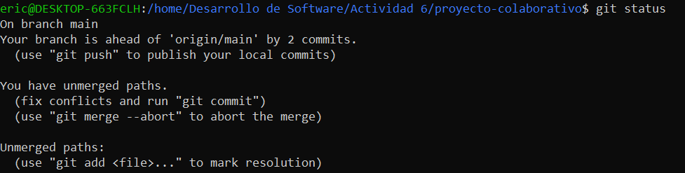

**1. Inicialización del proyecto y creación de ramas**
- Paso 1: Crea un nuevo proyecto en tu máquina local.
~~~
mkdir proyecto-colaborativo   # Crea un nuevo directorio llamado 'proyecto-colaborativo'
cd proyecto-colaborativo      # Cambia al directorio 'proyecto-colaborativo'
~~~

- Paso 2: Inicializa Git en tu proyecto.
~~~
git init   # Inicializa un nuevo repositorio Git en el directorio actual
~~~
- Paso 3: Crea un archivo de texto llamado archivo_colaborativo.txt y agrega algún contenido inicial.
~~~
echo "Este es el contenido inicial del proyecto" > archivo_colaborativo.txt   # Crea un archivo de texto con contenido inicial
~~~

- Paso 4: Agrega el archivo al área de staging y haz el primer commit.
~~~
git add .   # Añade todos los archivos (incluyendo 'archivo_colaborativo.txt') al área de staging
git commit -m "Commit inicial con contenido base"   # Realiza un commit con el mensaje "Commit inicial con contenido base"
~~~

- Paso 5: Crea dos ramas activas: main y feature-branch.
~~~
git branch feature-branch   # Crea una nueva rama llamada 'feature-branch'
~~~

- Paso 6: Haz checkout a la rama feature-branch y realiza un cambio en el archivo 
~~~
git checkout feature-branch   # Cambia a la rama 'feature-branch'
echo "Este es un cambio en la feature-branch" >> archivo_colaborativo.txt   # Añade una nueva línea al archivo en la rama 'feature-branch'
git add .   # Añade los cambios al área de staging
git commit -m "Cambios en feature-branch"   # Realiza un commit con el mensaje "Cambios en feature-branch"
~~~

- Paso 7: Regresa a la rama main y realiza otro cambio en la misma línea del archivo
~~~
git checkout main   # Cambia de nuevo a la rama 'main'
echo "Este es un cambio en la rama main" >> archivo_colaborativo.txt   # Añade una nueva línea al archivo en la rama 'main'
git add .   # Añade los cambios al área de staging
git commit -m "Cambios en main"   # Realiza un commit con el mensaje "Cambios en main"
~~~

**2. Fusión y resolución de conflictos**
- Paso 1: Intenta fusionar feature-branch en main. Se espera que surjan conflictos de fusión.
~~~
git merge feature-branch   # Intenta fusionar la rama 'feature-branch' en 'main'. Es probable que surjan conflictos en 'archivo_colaborativo.txt'
~~~

- Paso 2: Usa git status para identificar los archivos en conflicto. Examina los archivos afectados y resuelve manualmente los conflictos, conservando las líneas de código más relevantes para el proyecto.
~~~
git status   # Muestra los archivos en conflicto (marcados como 'unmerged')
git checkout --theirs archivo_colaborativo.txt   # Acepta los cambios de la rama 'feature-branch'
git checkout --ours archivo_colaborativo.txt   # Acepta los cambios de la rama 'main'
~~~

- Paso 3: Una vez resueltos los conflictos, commitea los archivos y termina la fusión
~~~
git add .   # Añade los archivos con conflictos resueltos al área de staging
git commit -m "Conflictos resueltos"   # Realiza un commit indicando que los conflictos han sido resueltos
~~~

**3. Simulación de fusiones y uso de git diff**
- Paso 1: Simula una fusión usando git merge --no-commit --no-ff para ver cómo se comportarían los cambios antes de realizar el commit.

~~~
git merge --no-commit --no-ff feature-branch   # Simula la fusión de 'feature-branch' en la rama actual sin hacer commit automáticamente ni usar fast-forward
git diff --cached   # Muestra los cambios que se han preparado en el área de staging después de la fusión simulada
git merge --abort   # Aborta la fusión y regresa el repositorio al estado anterior, deshaciendo cualquier cambio introducido por la fusión
~~~

**4. Uso de git mergetool**
- Paso 1: Configura git mergetool con una herramienta de fusión visual (puedes usar meld, vimdiff, o
Visual Studio Code).

~~~
git config --global merge.tool vscode  # Configura Visual Studio Code como herramienta de fusión por defecto
git mergetool  # Inicia la herramienta de fusión configurada para resolver conflictos
~~~

- Paso 2: Usa la herramienta gráfica para resolver un conflicto de fusión.

**5. Uso de git revert y git reset**
- Paso 1: Simula la necesidad de revertir un commit en main debido a un error. Usa git revert para crear un commit que deshaga los cambios.
~~~
git revert <commit_hash>  # Crea un nuevo commit que revierte los cambios del commit especificado
~~~

- Paso 2: Realiza una prueba con git reset --mixed para entender cómo reestructurar el historial de commits sin perder los cambios no commiteados.
~~~
git reset --mixed <commit_hash>  # Restablece el historial de commits hasta el commit especificado, pero conserva los cambios en el área de trabajo
~~~

6. Versionado semántico y etiquetado
- Paso 1: Aplica versionado semántico al proyecto utilizando tags para marcar versiones importantes.
~~~
git tag -a v1.0.0 -m "Primera versión estable"  # Crea un tag anotado llamado v1.0.0 con un mensaje
git push origin v1.0.0  # Envía el tag al repositorio remoto
~~~

7. Aplicación de git bisect para depuración
- Paso 1: Usa git bisect para identificar el commit que introdujo un error en el código.
~~~
git bisect start  # Inicia una búsqueda binaria para identificar el commit que causó un error
git bisect bad  # Indica que la versión actual tiene un error
git bisect good <último_commit_bueno>  # Indica que este commit es correcto, se inicia la búsqueda binaria entre "good" y "bad"
~~~

**Continúa marcando como "good" o "bad" hasta encontrar el commit que introdujo el error**
~~~
git bisect reset  # Sale del modo bisect y vuelve al estado normal
~~~

**8. Documentación y reflexión**
- Paso 1: Documenta todos los comandos usados y los resultados obtenidos en cada paso.
- Paso 2: Reflexiona sobre la utilidad de cada comando en un flujo de trabajo de DevOps.
> Trabajar con Git en un entorno DevOps ha sido una experiencia clave para mejorar la colaboración y el control sobre el proyecto. Crear ramas para desarrollar en paralelo facilita que cada uno pueda aportar sin interferir en la versión estable, y herramientas como `git mergetool` hacen que resolver conflictos sea más sencillo y visual. Cuando he cometido errores, revertir cambios con `git revert` o reorganizar el historial con `git reset` me ha permitido corregir sin perder el progreso. También he encontrado muy útil el uso de etiquetas para marcar versiones importantes y tener puntos claros de referencia. Además, `git bisect` ha sido una herramienta increíble para depurar, ayudándome a localizar errores de manera rápida y eficiente. En general, Git me ha dado control y flexibilidad, haciendo que todo el proceso de desarrollo sea más ágil y confiable.

**Preguntas**

**1. Ejercicio para git checkout --ours y git checkout --theirs**

**Contexto:** En un sprint ágil, dos equipos están trabajando en diferentes ramas. Se produce un conflicto de fusión en un archivo de configuración crucial. El equipo A quiere mantener sus cambios mientras el equipo B solo quiere conservar los suyos. El proceso de entrega continua está detenido debido a este conflicto.

**Pregunta:**

− ¿Cómo utilizarías los comandos git checkout --ours y git checkout --theirs para resolver este conflicto de manera rápida y eficiente? Explica cuándo preferirías usar cada uno de estos comandos y cómo impacta en la pipeline de CI/CD. ¿Cómo te asegurarías de que la resolución elegida no comprometa la calidad del código?
>Para resolver un conflicto rápido, usaría git checkout --ours si quiero mantener los cambios que hizo mi equipo, y git checkout --theirs cuando decido priorizar los cambios del otro equipo. Esto es útil en CI/CD para no detener la integración continua y aseguraría la calidad del código ejecutando pruebas automáticas después de la resolución.

**2. Ejercicio para git diff**
**Contexto:** Durante una revisión de código en un entorno ágil, se observa que un pull request tiene una gran cantidad de cambios, muchos de los cuales no están relacionados con la funcionalidad principal. Estos cambios podrían generar conflictos con otras ramas en la pipeline de CI/CD.

**Pregunta:**

− Utilizando el comando git diff, ¿cómo compararías los cambios entre ramas para identificar diferencias específicas en archivos críticos? Explica cómo podrías utilizar git diff feature-branch..main para detectar posibles conflictos antes de realizar una fusión y cómo esto contribuye a mantener la estabilidad en un entorno ágil con CI/CD.
>Utilizaría git diff para comparar los cambios entre ramas, y específicamente con git diff feature-branch..main, podría revisar diferencias clave antes de fusionar. Así detectaría conflictos potenciales y mantendría la estabilidad del proyecto en CI/CD, evitando introducir cambios innecesarios.

**3. Ejercicio para git merge --no-commit --no-ff**

**Contexto:** En un proyecto ágil con CI/CD, tu equipo quiere simular una fusión entre una rama de desarrollo y la rama principal para ver cómo se comporta el código sin comprometerlo inmediatamente en el repositorio. Esto es útil para identificar posibles problemas antes de
completar la fusión.

**Pregunta:**

− Describe cómo usarías el comando git merge --no-commit --no-ff para simular una fusión en tu rama local. ¿Qué ventajas tiene esta práctica en un flujo de trabajo ágil con CI/CD, y cómo ayuda a minimizar errores antes de hacer commits definitivos? ¿Cómo automatizarías este paso dentro de una pipeline CI/CD?
>Usaría git merge --no-commit --no-ff para simular una fusión y ver cómo se comporta el código sin comprometerlo. Esto es súper útil para detectar problemas antes de hacer el merge final. En CI/CD, lo automatizaría para simular fusiones antes de hacer commits definitivos y evitar errores en producción.

**4. Ejercicio para git mergetool**

**Contexto:** Tu equipo de desarrollo utiliza herramientas gráficas para resolver conflictos de manera colaborativa. Algunos desarrolladores prefieren herramientas como vimdiff o Visual Studio Code. En medio de un sprint, varios archivos están en conflicto y los desarrolladores prefieren trabajar en un entorno visual para resolverlos.

**Pregunta:**

− Explica cómo configurarías y utilizarías git mergetool en tu equipo para integrar herramientas gráficas que faciliten la resolución de conflictos. ¿Qué impacto tiene el uso de git mergetool en un entorno de trabajo ágil con CI/CD, y cómo aseguras que todos los miembros del equipo mantengan consistencia en las resoluciones?
>Configuraría git mergetool para usar herramientas visuales como VS Code, lo que facilita la resolución de conflictos en equipo. Esto ayuda mucho en un entorno ágil, donde podemos resolver conflictos de forma clara y rápida, manteniendo la consistencia en cómo cada miembro resuelve los conflictos.

**5. Ejercicio para git reset**

**Contexto:** En un proyecto ágil, un desarrollador ha hecho un commit que rompe la pipeline de CI/CD. Se debe revertir el commit, pero se necesita hacerlo de manera que se mantenga el código en el directorio de trabajo sin deshacer los cambios.

**Pregunta:**

− Explica las diferencias entre git reset --soft, git reset --mixed y git reset --hard. ¿En qué escenarios dentro de un flujo de trabajo ágil con CI/CD utilizarías cada uno? Describe un caso en el que usarías git reset --mixed para corregir un commit sin perder los cambios no commiteados y cómo afecta esto a la pipeline.
>Si necesito deshacer un commit que rompió la pipeline, usaría git reset --mixed, ya que me permitiría mantener los cambios en el directorio de trabajo para corregirlos sin perder nada, lo que es ideal en CI/CD porque no interrumpe el flujo de trabajo y puedo arreglar el problema antes de volver a intentar el commit. A diferencia de git reset --soft, que mantiene los cambios en staging listos para ser committeados nuevamente, o git reset --hard, que elimina completamente los cambios del directorio de trabajo, --mixed es la opción más flexible para corregir errores sin perder el progreso, siendo la más útil en un entorno de CI/CD.

**6. Ejercicio para git revert**

**Contexto:** En un entorno de CI/CD, tu equipo ha desplegado una característica a producción, pero se ha detectado un bug crítico. La rama principal debe revertirse para restaurar la estabilidad, pero no puedes modificar el historial de commits debido a las políticas del equipo.

**Pregunta:**

− Explica cómo utilizarías git revert para deshacer los cambios sin modificar el historial de commits. ¿Cómo te aseguras de que esta acción no afecte la pipeline de CI/CD y permita una rápida recuperación del sistema? Proporciona un ejemplo detallado de cómo revertirías varios commits consecutivos.
>Si necesito deshacer un cambio sin alterar el historial, usaría git revert, ya que crea un nuevo commit que revierte los cambios sin eliminar el commit original, manteniendo intacto el historial del proyecto. Esto es útil en entornos de CI/CD donde no podemos modificar el historial debido a políticas del equipo, pero necesitamos revertir rápidamente un cambio que ha afectado producción. Por ejemplo, si tres commits consecutivos han introducido un bug crítico, podría usar git revert HEAD~2..HEAD para deshacer esos tres commits, manteniendo el flujo de trabajo activo y el historial de commits limpio y organizado.

**7. Ejercicio para git stash**

**Contexto:** En un entorno ágil, tu equipo está trabajando en una corrección de errores urgente mientras tienes cambios no guardados en tu directorio de trabajo que aún no están listos para ser committeados. Sin embargo, necesitas cambiar rápidamente a una rama de hotfix para trabajar en la corrección.

**Pregunta:**

− Explica cómo utilizarías git stash para guardar temporalmente tus cambios y volver a ellos después de haber terminado el hotfix. ¿Qué impacto tiene el uso de git stash en un flujo de trabajo ágil con CI/CD cuando trabajas en múltiples tareas? ¿Cómo podrías automatizar el proceso de stashing dentro de una pipeline CI/CD?
>Si tengo cambios no guardados en mi directorio y necesito cambiar rápidamente a una rama de hotfix, utilizaría git stash para guardar esos cambios de manera temporal sin tener que hacer un commit. Esto me permite moverme a la rama de hotfix, solucionar el problema y luego recuperar mis cambios guardados con git stash pop una vez terminado el hotfix. En un entorno ágil con CI/CD, git stash es útil porque me permite manejar múltiples tareas sin perder progreso ni interrumpir la pipeline, manteniendo el flujo de trabajo flexible y sin bloqueos. Para automatizar este proceso en una pipeline CI/CD, podría utilizar un script que haga git stash antes de cambiar de rama en casos donde se detecten cambios no committeados, asegurando que ningún cambio temporal afecte la estabilidad del sistema durante las correcciones urgentes.

**8. Ejercicio para .gitignore**

**Contexto:** Tu equipo de desarrollo ágil está trabajando en varios entornos locales con configuraciones diferentes (archivos de logs, configuraciones personales). Estos archivos no deberían ser parte del control de versiones para evitar confusiones en la pipeline de CI/CD.

**Pregunta:**

− Diseña un archivo .gitignore que excluya archivos innecesarios en un entorno ágil de desarrollo. Explica por qué es importante mantener este archivo actualizado en un equipo colaborativo que utiliza CI/CD y cómo afecta la calidad y limpieza del código compartido en el repositorio.
>Mantener el .gitignore actualizado es esencial en un equipo con CI/CD porque evita que archivos innecesarios, como logs y configuraciones locales, entren al repositorio. Esto mantiene el código limpio, evita conflictos entre entornos y asegura que solo los archivos relevantes se compartan, mejorando la calidad y estabilidad del proyecto.

**Adicional**

**Ejercicio 1: Resolución de conflictos en un entorno ágil**
**Contexto:** Estás trabajando en un proyecto ágil donde múltiples desarrolladores están enviando cambios a la rama principal cada día. Durante una integración continua, se detectan conflictos de fusión entre las ramas de dos equipos que están trabajando en dos funcionalidades críticas. Ambos equipos han modificado el mismo archivo de configuración del proyecto.

**Pregunta:**

- ¿Cómo gestionarías la resolución de este conflicto de manera eficiente utilizando Git y manteniendo la entrega continua sin interrupciones? ¿Qué pasos seguirías para minimizar el impacto en la CI/CD y asegurar que el código final sea estable?
>Para gestionar un conflicto de fusión, primero me aseguraría de que todos los cambios sean compatibles usando git merge y resolviendo los conflictos de inmediato. Luego, ejecutaría pruebas en CI/CD para asegurar que los cambios no rompan el pipeline y garantizar que el código fusionado sea estable.

**Ejercicio 2: Rebase vs. Merge en integraciones ágiles**
**Contexto:**En tu equipo de desarrollo ágil, cada sprint incluye la integración de varias ramas de características. Algunos miembros del equipo prefieren realizar merge para mantener el historial completo de commits, mientras que otros prefieren rebase para mantener un historial lineal.

**Pregunta:**

- ¿Qué ventajas y desventajas presenta cada enfoque (merge vs. rebase) en el contexto de la metodología ágil? ¿Cómo impacta esto en la revisión de código, CI/CD, y en la identificación rápida de errores?.
>Prefiero usar git rebase cuando necesito mantener un historial lineal y claro, lo que facilita la revisión de código y reduce conflictos. Sin embargo, git merge es útil cuando queremos conservar el historial completo. En CI/CD, el rebase ayuda a evitar conflictos, mientras que el merge es útil para rastrear cada contribución.

**Ejercicio 3: Git Hooks en un flujo de trabajo CI/CD ágil**

**Contexto:**Tu equipo está utilizando Git y una pipeline de CI/CD que incluye tests unitarios, integración continua y despliegues automatizados. Sin embargo, algunos desarrolladores accidentalmente comiten código que no pasa los tests locales o no sigue las convenciones de estilo definidas por el equipo.

**Pregunta:**

- Diseña un conjunto de Git Hooks que ayudaría a mitigar estos problemas, integrando validaciones de estilo y tests automáticos antes de permitir los commits. Explica qué tipo de validaciones implementarías y cómo se relaciona esto con la calidad del código y la entrega continua en un entorno ágil.
>Diseñar hooks como pre-commit para validar que el código sigue los estándares de estilo y pasar las pruebas locales antes de permitir un commit. Esto evita que los desarrolladores suban código que rompa el pipeline de CI/CD y asegura que el código tenga buena calidad desde el principio.

**Ejercicio 4: Estrategias de branching en metodologías ágiles**

**Contexto:** Tu equipo de desarrollo sigue una metodología ágil y está utilizando Git Flow para gestionar el ciclo de vida de las ramas. Sin embargo, a medida que el equipo ha crecido, la gestión de las ramas se ha vuelto más compleja, lo que ha provocado retrasos en la integración y conflictos de fusión frecuentes.

**Pregunta:**

- Explica cómo adaptarías o modificarías la estrategia de branching para optimizar el flujo de trabajo del equipo en un entorno ágil y con integración continua. Considera cómo podrías integrar feature branches, release branches y hotfix branches de manera que apoyen la entrega continua y minimicen conflictos.
>Modificaría la estrategia de branching para hacer fusiones más frecuentes y evitar ramas largas, reduciendo los conflictos de última hora. En CI/CD, esto nos ayudaría a integrar cambios más rápido y mantener la entrega continua funcionando sin problemas, minimizando los tiempos muertos por fusiones complejas.

**Ejercicio 5: Automatización de reversiones con git en CI/CD**

**Contexto:** Durante una integración continua en tu pipeline de CI/CD, se detecta un bug crítico después de haber fusionado varios commits a la rama principal. El equipo necesita revertir los cambios rápidamente para mantener la estabilidad del sistema.

**Pregunta:**

- ¿Cómo diseñarías un proceso automatizado con Git y CI/CD que permita revertir cambios de manera eficiente y segura? Describe cómo podrías integrar comandos como git revert o git reset en la pipeline y cuáles serían los pasos para garantizar que los bugs se reviertan sin afectar el desarrollo en curso.
>Automatizaría la reversión de commits con git revert en la pipeline de CI/CD para que, si se detecta un bug crítico, los cambios se reviertan de inmediato sin afectar otros desarrollos en curso. Esto nos permite recuperar el sistema rápidamente mientras seguimos trabajando en el arreglo del bug.
