# Actividad: Gestión ágil de sprints con GitHub: planificación, ejecución y cierre de Sprints.

**1: Configuración de Sprints**
En este ejercicio, configurarás tus sprints. GitHub configurará tres (3) sprints de forma predeterminada para que puedas comenzar. Luego, creará nuevos sprints automáticamente según sea necesario.

1. Ve a GitHub, inicia sesión con tu cuenta de GitHub, y abre tu Kanban board.
2. Para crear el sprint, haz clic en el botón desplegable junto a Backlog. Luego, haz clic en la flecha derecha junto a Fields y selecciona New field.

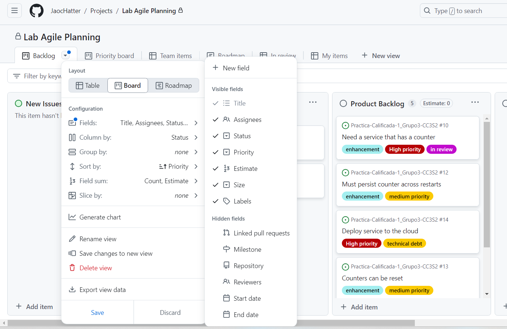

3. Aparecerá una ventana emergente. Introduce "Sprint" como el nombre del campo, elige "Iteration" como el tipo de campo, y deja la fecha de inicio en la fecha actual. Mantén la duración en dos semanas. Finalmente, haz clic en el botón Save and create.

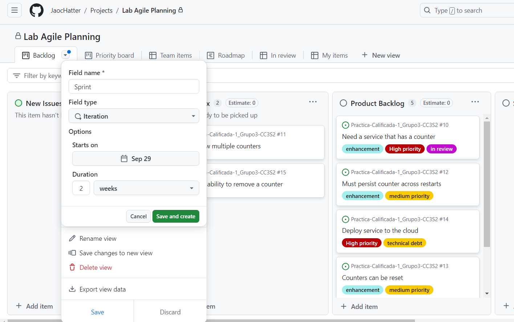

4. Ahora tienes un sprint que se puede usar para la planificación del sprint en el próximo ejercicio.

**2: Crear un plan Sprint**
En este ejercicio, crearás un sprint plan. Asignaremos puntos de historia estimados y un sprint, y moveremos las historias del Product Backlog al Sprint Backlog para construir nuestro plan.

1. Selecciona la historia superior "Need a service that has a counter" del Product Backlog para abrirla.

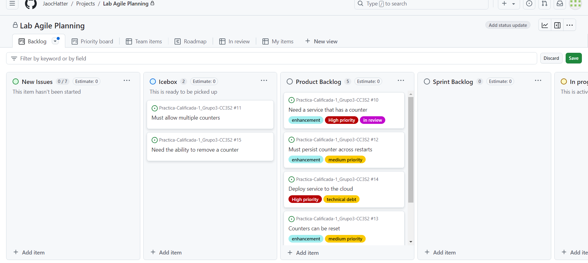

2. Discutiste la historia con el equipo, y tus desarrolladores están de acuerdo en que esta es una historia grande que vale 8 puntos de historia, así que establece el Estimate en 8.

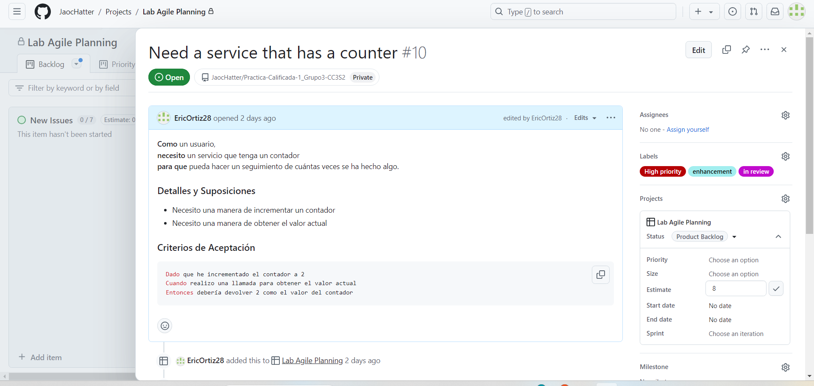
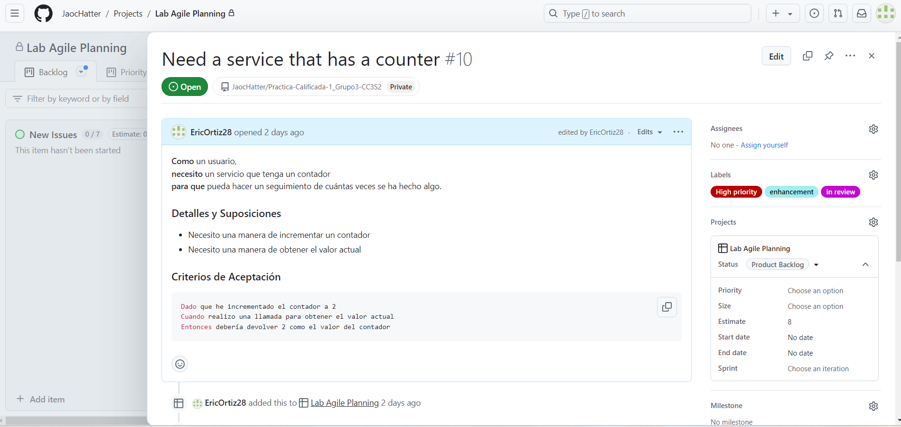

3. Haz clic en "Choose an iteration" junto a Sprints y selecciona el primer sprint de la lista desplegable para asignar la historia a ese sprint. Puedes asignar una historia a más de un sprint, pero esto no es muy ágil. Si tu historia es más grande que un sprint, entonces es demasiado grande y debe dividirse en historias más pequeñas "del tamaño de un sprint".

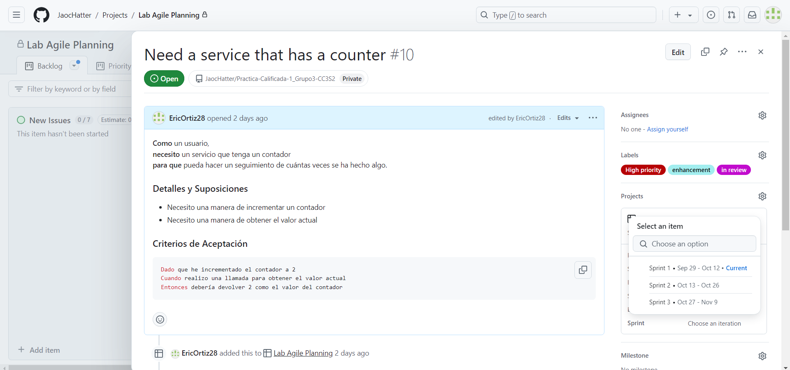
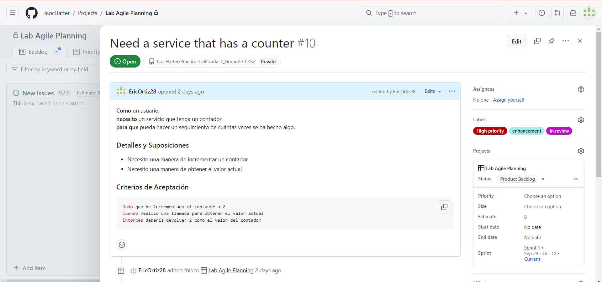

4. Tu historia debería verse como la siguiente. Haz clic en la "X" para cerrar la ventana de la historia y volver al Kanban board.

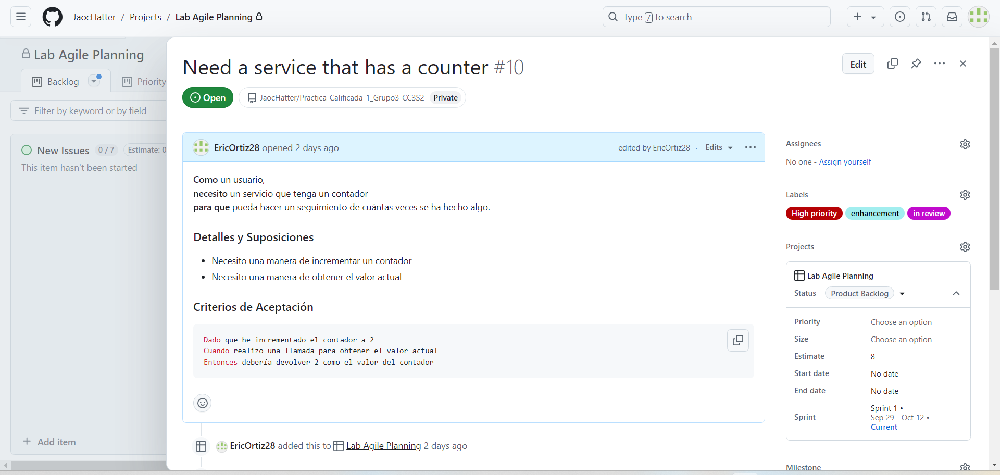

5. El equipo de desarrollo ha determinado que agregar una historia de 8 puntos al sprint es aceptable. Arrastra la historia del Product Backlog al Sprint Backlog.
**Nota:** Puedes ver las fechas de inicio y fin de la historia de usuario pasando el ratón sobre el Sprint que se muestra en la tarjeta.

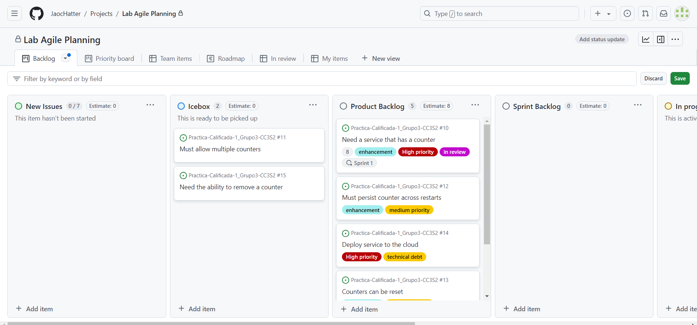

6. Tu Kanban board debería verse ahora como el siguiente. Observa que la estimación de puntos de historia y las fechas del sprint son anotaciones en la historia.

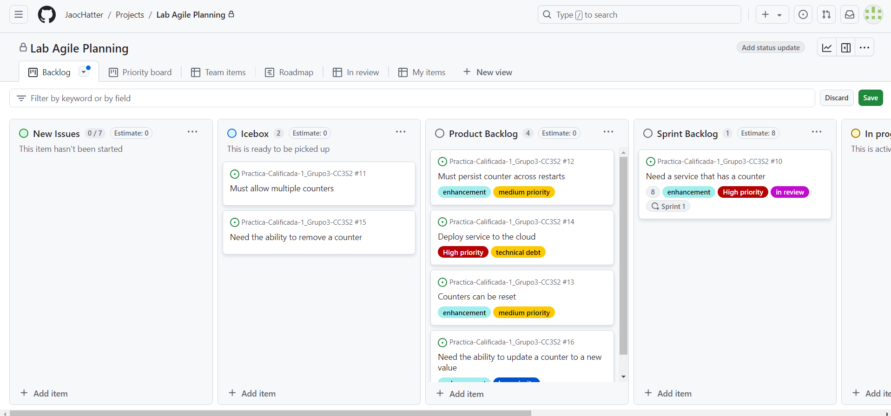

7. La reunión de planificación del sprint ha avanzado bien. En las discusiones con el equipo de desarrollo, han estimado las siguientes dos historias en el Product Backlog y han determinado que ambas pueden caber en el sprint actual. Selecciona cada una de las siguientes historias en el Product Backlog, asígnales los puntos de historia correspondientes y el mismo Sprint, y arrástralas al Sprint Backlog en el mismo orden.

Título de la Historia Puntos de Historia

 Must persist counter across restarts 5
 Deploy service to the cloud 5

Al final de este paso, tu sprint plan debería verse así:

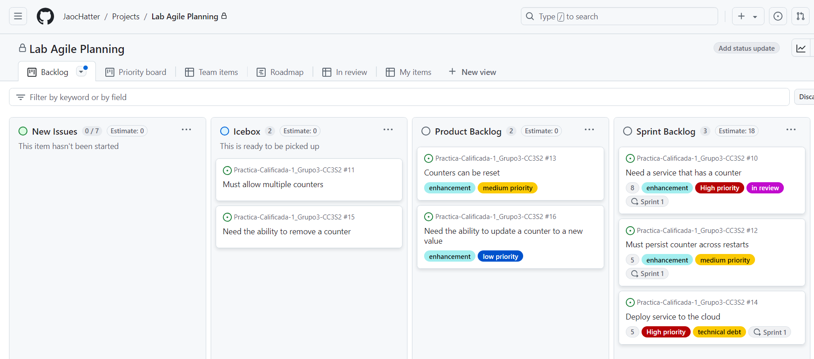

8. Basado en la velocidad del equipo, el equipo de desarrollo ha decidido que hay suficientes
historias en el sprint, pero queda algo de tiempo en la reunión de planificación del sprint
para estimar más historias. Añade las siguientes estimaciones a las historias en el Product
Backlog.

Counters can be reset 3
Need ability to update a counter to new value 5

Al final de este ejercicio, tu Kanban board debería verse así:

