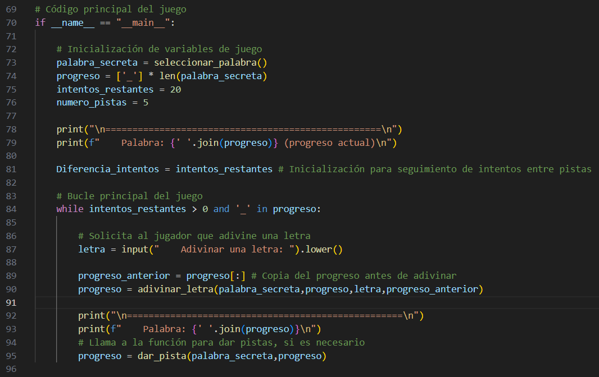
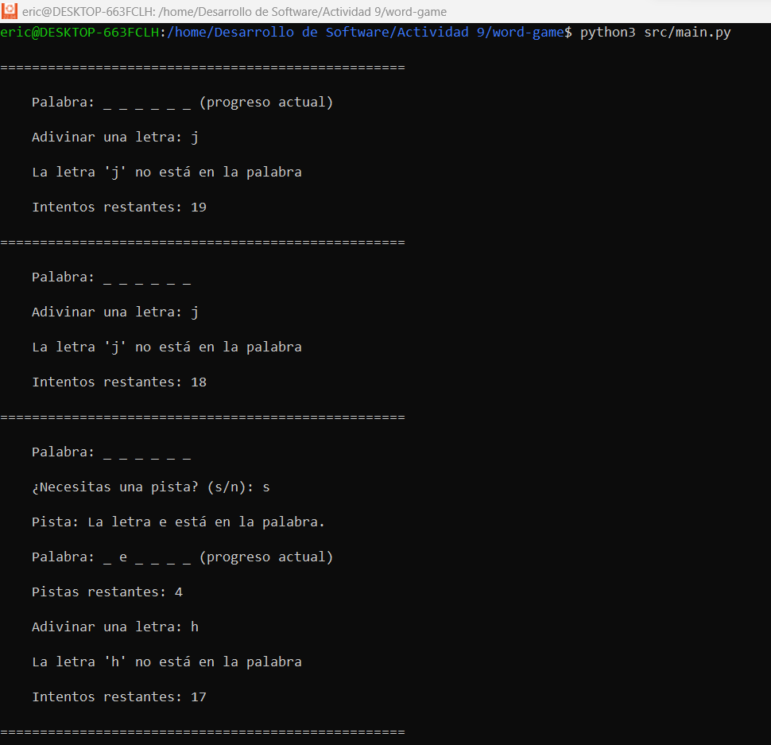

# Desarrollo Ágil de un Juego de Adivinanza de Palabras Utilizando BDD y Control de Versiones

## Proyecto : Juego de adivinanza de palabras (Word Guessing Game)

---

### **Descripción del Juego**

El objetivo del juego es adivinar una palabra secreta letra por letra. Tienes un número limitado de intentos para adivinar todas las letras de la palabra. Cada vez que introduces una letra:

- Si la letra está en la palabra, se revela en su posición correspondiente.
- Si la letra no está en la palabra, pierdes un intento.
- También puedes solicitar pistas, pero el número de pistas es limitado.

El juego termina cuando:
1. Adivinas todas las letras de la palabra.
2. Te quedas sin intentos y pierdes.

### **Instrucciones para Ejecutar en Ubuntu**

#### 1. **Instalar Python 3 (si no está instalado)**
Si no tienes Python 3 instalado, usa este comando para instalarlo:
```bash
sudo apt update
sudo apt install python3
```
Verifica la instalación de Python 3 con:
```bash
python3 --version
```

#### 2. **Cambiar al Directorio del Juego**
Suponiendo que tu proyecto está ubicado en `/home/usuario/Actividad 9/word-game`, navega a este directorio usando el siguiente comando:
```bash
cd "/home/usuario/Actividad 9/word-game"
```

Si el directorio tiene espacios en el nombre, recuerda usar comillas o escapar los espacios con `\`.


#### 3. **Ejecutar el Juego**
Una vez que estés ubicado en el directorio correcto, ejecuta el juego con el siguiente comando:
```bash
python3 src/main.py
```

Este comando ejecuta el archivo `main.py` dentro del directorio `src`.

#### 4. **Jugar**
Sigue las instrucciones que te aparecen en la terminal:
- **Introduce una letra** para intentar adivinarla. Si la letra está en la palabra, se revela en la posición correcta. Si no, pierdes un intento.
- **Solicitar pistas**: Después de dos intentos fallidos, puedes recibir una pista si quedan disponibles.

#### 5. **Salir del Juego**
Si deseas salir del juego, simplemente presiona `Ctrl + C` en cualquier momento para detener la ejecución.

---

**Sprint 1: Configuración de repositorios y flujo de trabajo básico**

**Objetivo del sprint:** Configurar el proyecto en GitHub, preparar la estructura básica del juego, y establecer el flujo de trabajo.

**Funcionalidades implementadas:**

1. Estructura básica del Juego:

~~~
mkdir word-game
cd word-game
~~~


>Primero, se creo un directorio para el proyecto y se navego dentro de el.

− Crear un archivo principal (main.py o WordGame.java).

~~~
touch src/main.py
~~~


>Crea el archivo principal para el juego (main.py) dentro de src.

− Añadir un archivo de texto (words.txt) con una lista de palabras para el juego.

~~~
touch words.txt
~~~


− Crear un directorio para futuras funcionalidades, por ejemplo, src/, tests/

~~~
mkdir src tests
~~~


>Decidi colocar main.py dentro de src.

**Tipo de salida esperada:**

- README.md: Contendrá una breve descripción del juego, cómo ejecutar el código, y las
funcionalidades futuras.

- Primera ejecución:

    º Ejecutar el archivo principal con un mensaje de bienvenida al juego.
    º Ejemplo de salida:
    Bienvenido al Juego de Adivinanza de Palabras!

    La configuración inicial del juego se ha completado.


~~~
python3 src/main.py
~~~


---

**Sprint 2: Desarrollo colaborativo y control de versiones**

**Objetivo del sprint:** Implementar las funcionalidades clave del juego, incluyendo la lógica de adivinanza, la selección de palabras aleatorias, y el sistema de pistas.
Funcionalidades implementadas:

1. Selección aleatoria de palabras:

    − Función seleccionar_palabra() que selecciona una palabra al azar de words.txt.

    − Salida: "La palabra ha sido seleccionada. ¡Comienza a adivinar!"


> Selecciona una palabra aleatoria del archivo 'words.txt'.
Lee todas las palabras en el archivo 'words.txt', las almacena en una lista y devuelve una palabra seleccionada al azar.

2. Lógica de adivinanza:

    − Función adivinar_letra(letra):

        º Recibe una letra del jugador y verifica si está en la palabra secreta.

        º Actualiza el progreso del jugador.

        º Controla los intentos restantes.

    − Salida:

        Palabra: _ _ _ _ _ (progreso actual)
        Adivina una letra: a
        ¡Correcto! La letra 'a' está en la palabra.
        Palabra: a _ _ _ a


>Comprueba si la letra ingresada está en la palabra secreta y si es asi actualiza el progreso del jugador.

3. Sistema de pistas limitadas:

    − Función dar_pista():
        º Ofrece al jugador una pista revelando una letra aleatoria de la palabra secreta.
        º Limita el número de pistas disponibles.
    − Salida:
        Pista: La letra 'e' está en la palabra.

Tipo de salida esperada:

    − Juego en consola:
        º Interactivo, permite al jugador ingresar letras y recibir retroalimentación en tiempo real.
        º Flujo de ejemplo
    Bienvenido al Juego de Adivinanza de Palabras!
    La palabra ha sido seleccionada. ¡Comienza a adivinar!
    Palabra: _ _ _ _ _
    Adivina una letra: e
    ¡Correcto! La letra 'e' está en la palabra.
    Palabra: _ e _ _ _
    ¿Necesitas una pista? (s/n): s
    Pista: La letra 'r' está en la palabra.
    Palabra: _ e _ _ r


>Se mejoró la función adivinar_letra() para que esta pueda manejar los intentos con variables globales.


>Ofrece una pista al jugador, revelando una letra adicional en la palabra secreta si se cumplen las condiciones.



>Ahora el flujo principal del juego permite al jugador adivinar letras, monitorear el progreso y obtener pistas si están disponibles gracias a las funciones.




>También se mejoró la interfaz de consola para que el jugador tenga una mejor experiencia.
---

**Sprint 3: Despliegue y gestión de versiones**

**Objetivo del sprint:** Completar el juego, preparar para el despliegue, y gestionar las versiones de manera efectiva.

**Funcionalidades implementadas:**

1. Finalización de juego:

    − Verifica si el jugador ha adivinado todas las letras o se ha quedado sin intentos.
    − Salida:

        º Victoria:
            ¡Felicidades! Has adivinado la palabra: 'perro'

        º Derrota:
            Lo siento, has perdido. La palabra era: 'perro'


2. Gestión de versiones y despliegue:

    − Etiquetar la versión final (v1.0.0).
    
    − Configurar GitHub Actions para empaquetar el juego y crear una versión descargable.
    
    − Despliegue automático al realizar un merge en main.

3. Hotfixes:

    − Implementar correcciones rápidas si se encuentran errores críticos.
    − Fusionar hotfixes en main y develop.

Tipo de salida esperada:

    Juego completo:

    − El juego debe ser jugable de principio a fin.
    − La interfaz de consola debe ser clara e interactiva.


    Gestión de versiones:

    − Tags en el repositorio GitHub para cada versión (v1.0.0, v1.1.0, etc.).


    Despliegue automático:

    − El juego se despliega automáticamente como un script ejecutable o binario descargable..


~~~
python3 pyinstxtractor.py main
~~~
